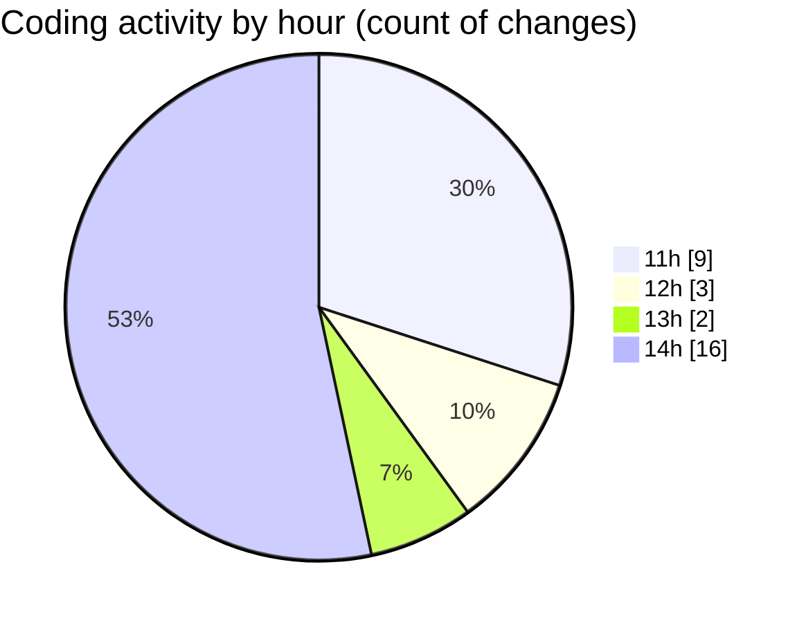

# monteur_automatique - Activity Summary 

## Overall Statistics

| Stat                   | Value                                                             |
| ---------------------- | ----------------------------------------------------------------- |
| **Lines Added** (➕)   | 164                                          |
| **Lines Removed** (➖) | 27                                        |
| **Net Change** (↕)    | 137                |
| **Active Time** (⌚)   | 40 minutes |

## Modified Files
- **main.py** (+11, -0)
- **video_processor.py** (+140, -27)
- **audio_processor.py** (+11, -0)
- **.gitignore** (+2, -0)

## Visualizations

### By File Type (Lines Changed)

### By Hour (Estimated Activity Count)

> **Last Updated:** 1/21/2025, 2:54:19 PM