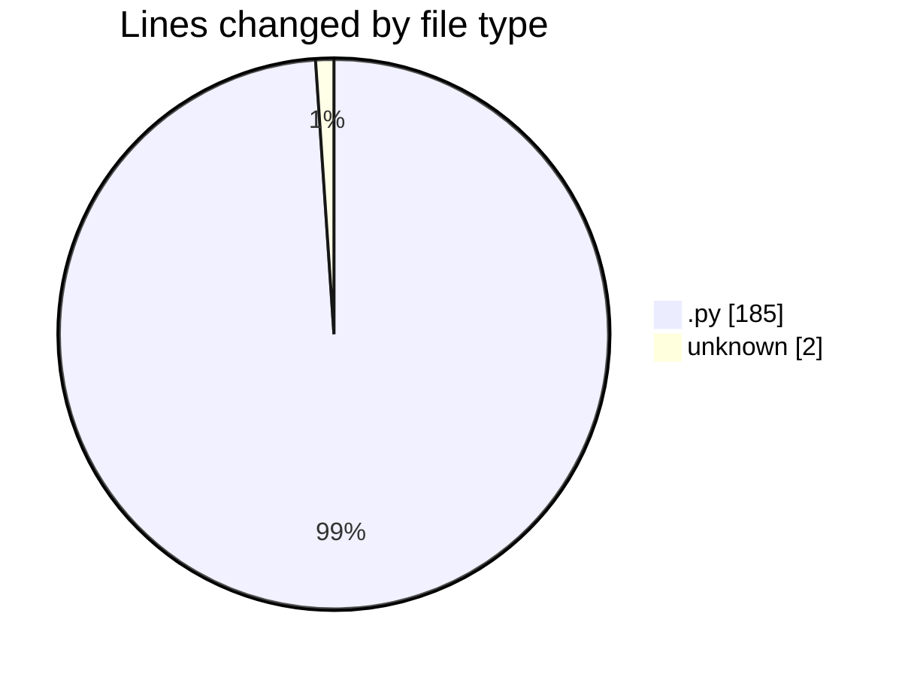
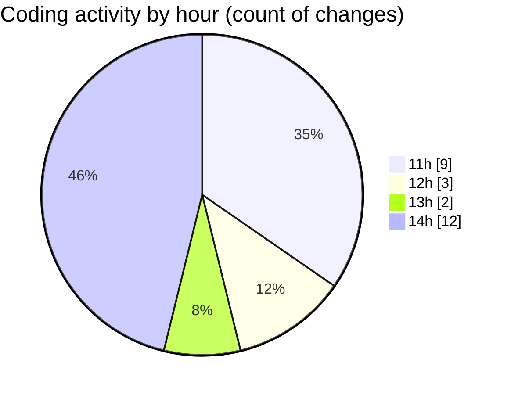

# monteur_automatique - Activity Summary 

## Overall Statistics

| Stat                   | Value                                                             |
| ---------------------- | ----------------------------------------------------------------- |
| **Lines Added** (➕)   | 162                                          |
| **Lines Removed** (➖) | 25                                        |
| **Net Change** (↕)    | 137                |
| **Active Time** (⌚)   | 37 minutes |

## Modified Files
- **main.py** (+11, -0)
- **video_processor.py** (+138, -25)
- **audio_processor.py** (+11, -0)
- **.gitignore** (+2, -0)

## Visualizations

### By File Type (Lines Changed)

### By Hour (Estimated Activity Count)

> **Last Updated:** 1/21/2025, 2:39:19 PM