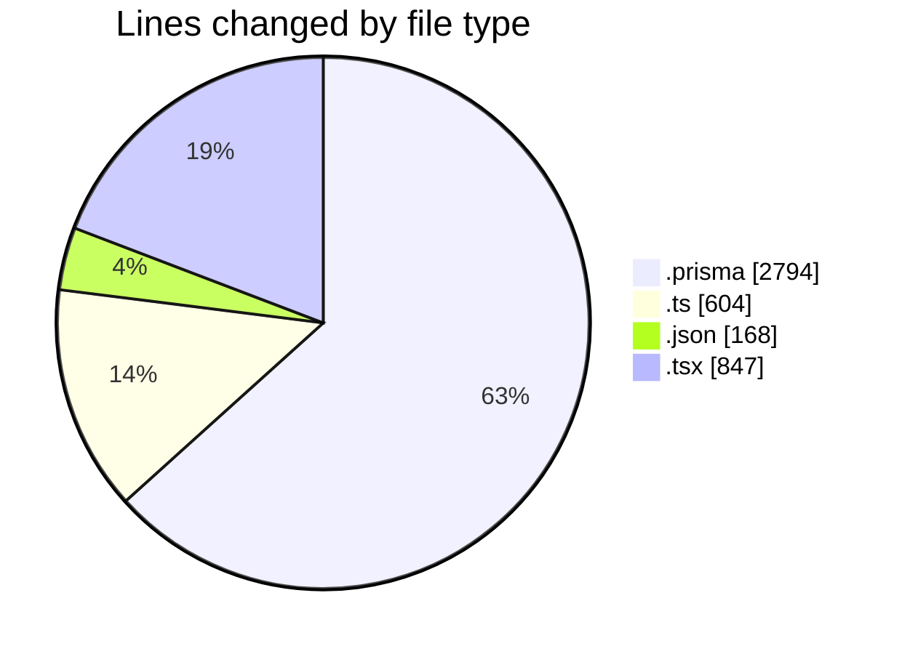
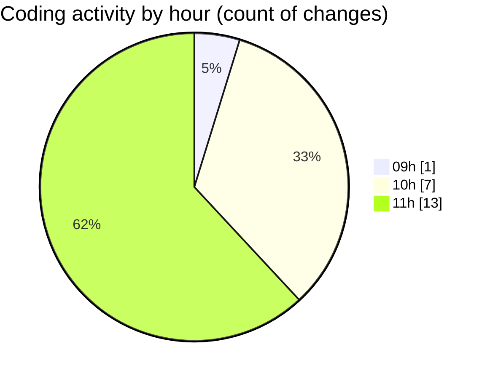

# ecodeli - Activity Summary 

## Overall Statistics

| Stat                   | Value                                                             |
| ---------------------- | ----------------------------------------------------------------- |
| **Lines Added** (➕)   | 3354                                          |
| **Lines Removed** (➖) | 1059                                        |
| **Net Change** (↕)    | 2295                |
| **Active Time** (⌚)   | 30 minutes |

## Modified Files
- **schema.prisma** (+1785, -1009)
- **route.ts** (+95, -8)
- **auth.action.ts** (+274, -0)
- **package.json** (+167, -1)
- **page.tsx** (+518, -0)
- **route.ts** (+9, -0)
- **next-auth.ts** (+201, -17)
- **login-form.tsx** (+305, -24)

## Visualizations

### By File Type (Lines Changed)

### By Hour (Estimated Activity Count)

> **Last Updated:** 5/1/2025, 12:02:16 PM