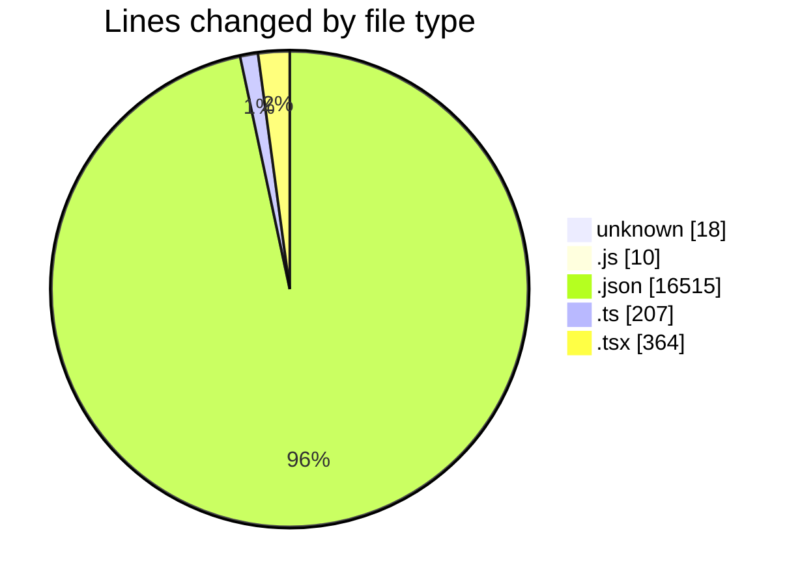
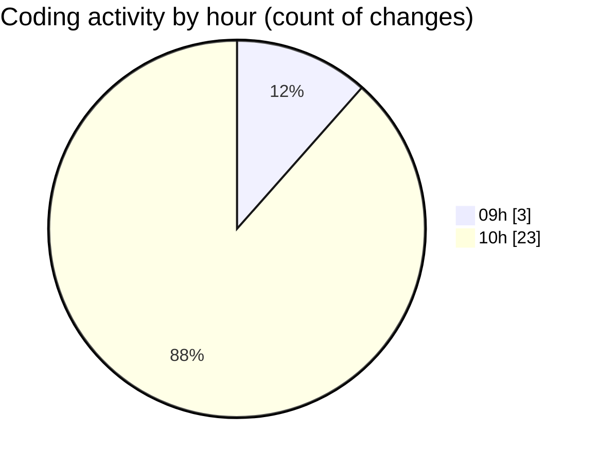

# ecodeli - Activity Summary 

## Overall Statistics

| Stat                   | Value                                                             |
| ---------------------- | ----------------------------------------------------------------- |
| **Lines Added** (➕)   | 17100                                          |
| **Lines Removed** (➖) | 14                                        |
| **Net Change** (↕)    | 17086                |
| **Active Time** (⌚)   | 23 minutes |

## Modified Files
- **pre-commit** (+3, -7)
- **lint-staged.config.js** (+10, -0)
- **package.json** (+3, -1)
- **.env** (+8, -0)
- **login.schema.ts** (+84, -0)
- **register.schema.ts** (+83, -0)
- **merchant-register.schema.ts** (+40, -0)
- **test-utils.tsx** (+51, -0)
- **login-form.test.tsx** (+111, -1)
- **package-lock.json** (+16511, -0)
- **Todo.test.tsx** (+109, -1)
- **auth.test.tsx** (+87, -4)

## Visualizations

### By File Type (Lines Changed)

### By Hour (Estimated Activity Count)

> **Last Updated:** 5/2/2025, 10:49:26 AM