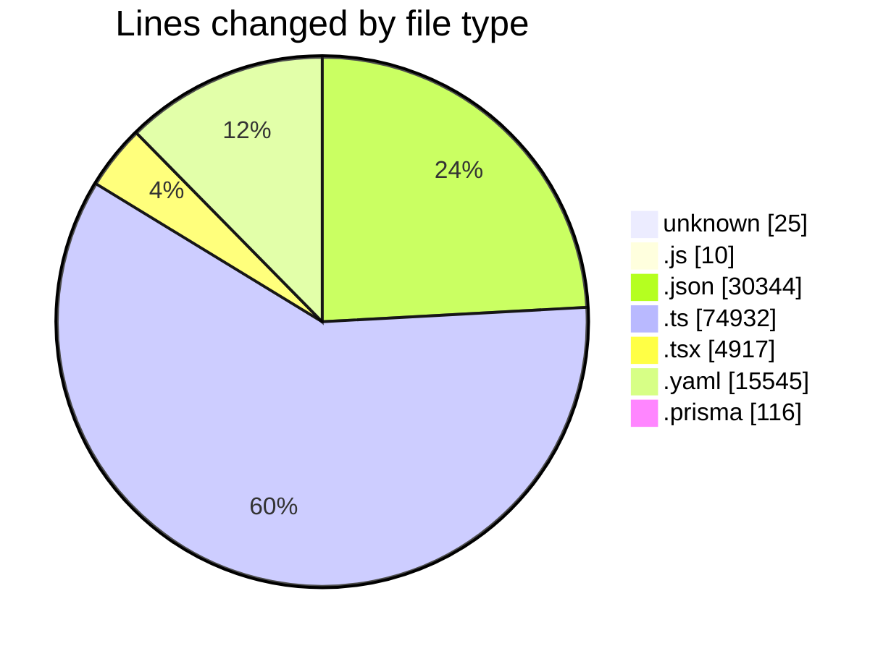
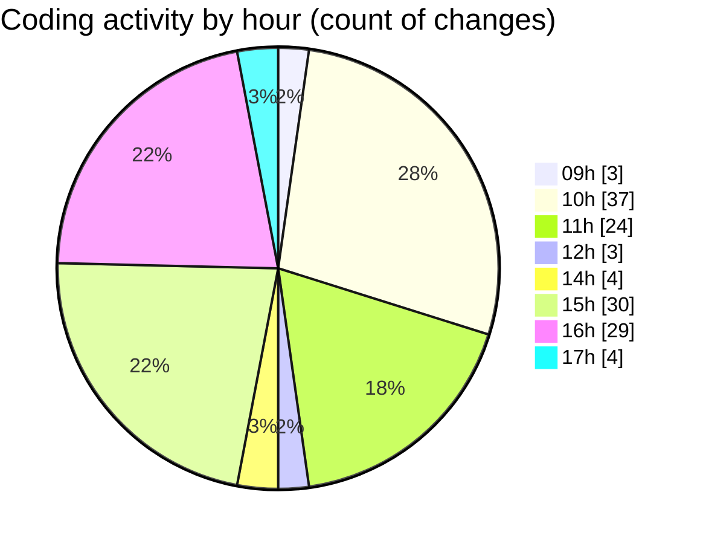

# ecodeli - Activity Summary 

## Overall Statistics

| Stat                   | Value                                                             |
| ---------------------- | ----------------------------------------------------------------- |
| **Lines Added** (➕)   | 121232                                          |
| **Lines Removed** (➖) | 4657                                        |
| **Net Change** (↕)    | 116575                |
| **Active Time** (⌚)   | 161 minutes |

## Modified Files
- **pre-commit** (+10, -7)
- **lint-staged.config.js** (+10, -0)
- **package.json** (+23, -5)
- **.env** (+8, -0)
- **login.schema.ts** (+84, -2)
- **register.schema.ts** (+83, -7)
- **merchant-register.schema.ts** (+40, -0)
- **test-utils.tsx** (+51, -0)
- **login-form.test.tsx** (+221, -111)
- **package-lock.json** (+16511, -0)
- **Todo.test.tsx** (+109, -1)
- **auth.test.tsx** (+87, -4)
- **use-localized-format.test.ts** (+106, -1)
- **vitest.config.ts** (+22, -1)
- **setup.ts** (+62, -1)
- **pnpm-lock.yaml** (+15058, -487)
- **route.ts** (+0, -5)
- **use-auth.ts** (+11, -9)
- **schema.prisma** (+116, -0)
- **layout.tsx** (+63, -20)
- **SessionCheckRedirect.tsx** (+44, -21)
- **routes.ts** (+10, -0)
- **client-register-form.tsx** (+262, -17)
- **en.json** (+6634, -2719)
- **fr.json** (+4433, -19)
- **trpc.ts** (+204, -0)
- **deliverer-register.schema.ts** (+75, -45)
- **document-upload.tsx** (+189, -0)
- **deliverer-onboarding.tsx** (+261, -0)
- **upload-document.ts** (+141, -140)
- **get-documents.ts** (+85, -0)
- **use-deliverer-verification.ts** (+65, -0)
- **page.tsx** (+71, -0)
- **document-verification.tsx** (+329, -328)
- **page.tsx** (+178, -0)
- **middleware.ts** (+336, -3)
- **route.ts** (+150, -149)
- **route.ts** (+182, -181)
- **route.ts** (+118, -0)
- **page.tsx** (+324, -0)
- **verification-list.tsx** (+290, -88)
- **page.tsx** (+110, -40)
- **index.d.ts** (+72175, -0)
- **page.tsx** (+4, -0)
- **page.tsx** (+55, -28)
- **document-upload.tsx** (+347, -129)
- **use-onboarding.ts** (+266, -72)
- **deliverer-verification-context.tsx** (+131, -0)
- **layout.tsx** (+38, -3)
- **DelivererRegisterForm.tsx** (+288, -0)
- **page.tsx** (+72, -14)
- **deliverer-register-form.tsx** (+287, -0)
- **deliverer-document-upload.tsx** (+302, -0)
- **use-documents.ts** (+101, -0)

## Visualizations

### By File Type (Lines Changed)

### By Hour (Estimated Activity Count)

> **Last Updated:** 5/2/2025, 5:14:35 PM