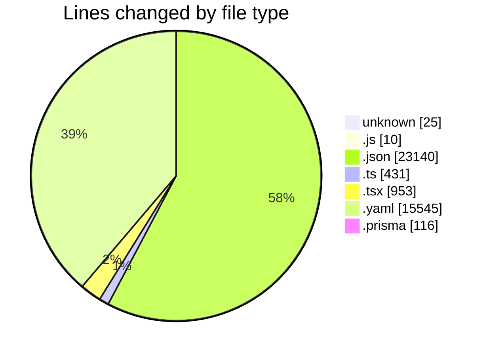
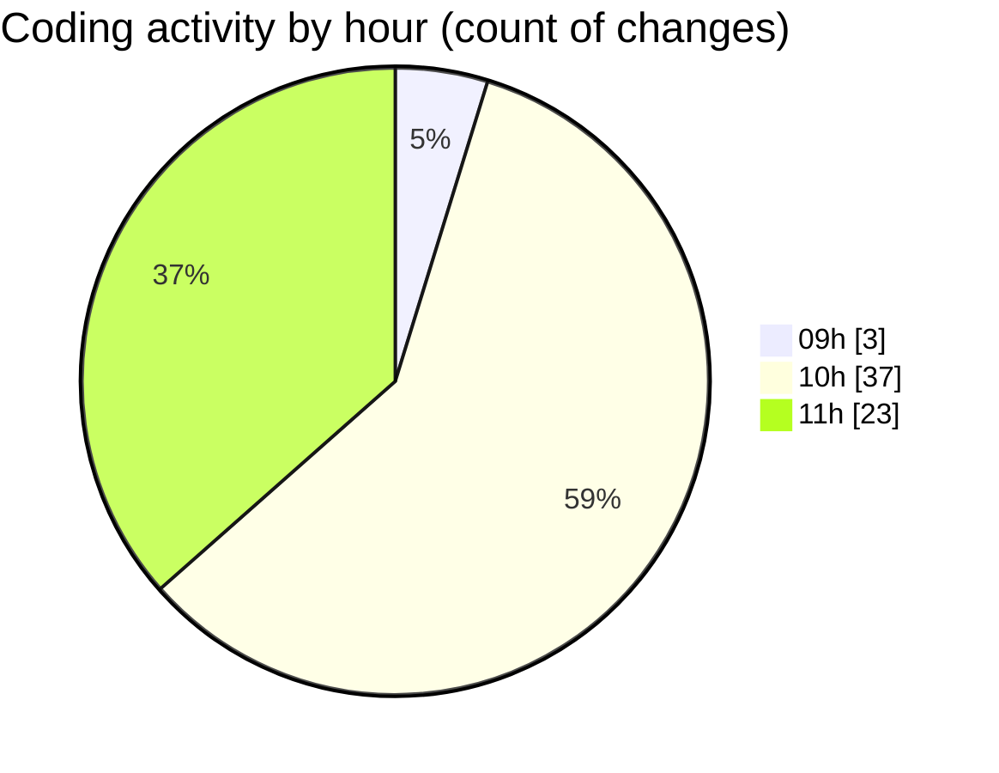

# ecodeli - Activity Summary 

## Overall Statistics

| Stat                   | Value                                                             |
| ---------------------- | ----------------------------------------------------------------- |
| **Lines Added** (➕)   | 36902                                          |
| **Lines Removed** (➖) | 3318                                        |
| **Net Change** (↕)    | 33584                |
| **Active Time** (⌚)   | 66 minutes |

## Modified Files
- **pre-commit** (+10, -7)
- **lint-staged.config.js** (+10, -0)
- **package.json** (+23, -5)
- **.env** (+8, -0)
- **login.schema.ts** (+84, -2)
- **register.schema.ts** (+83, -7)
- **merchant-register.schema.ts** (+40, -0)
- **test-utils.tsx** (+51, -0)
- **login-form.test.tsx** (+221, -111)
- **package-lock.json** (+16511, -0)
- **Todo.test.tsx** (+109, -1)
- **auth.test.tsx** (+87, -4)
- **use-localized-format.test.ts** (+106, -1)
- **vitest.config.ts** (+22, -1)
- **setup.ts** (+62, -1)
- **pnpm-lock.yaml** (+15058, -487)
- **route.ts** (+0, -5)
- **use-auth.ts** (+7, -0)
- **schema.prisma** (+116, -0)
- **layout.tsx** (+63, -0)
- **SessionCheckRedirect.tsx** (+44, -0)
- **routes.ts** (+10, -0)
- **client-register-form.tsx** (+262, -0)
- **en.json** (+3915, -2686)

## Visualizations

### By File Type (Lines Changed)

### By Hour (Estimated Activity Count)

> **Last Updated:** 5/2/2025, 11:54:26 AM