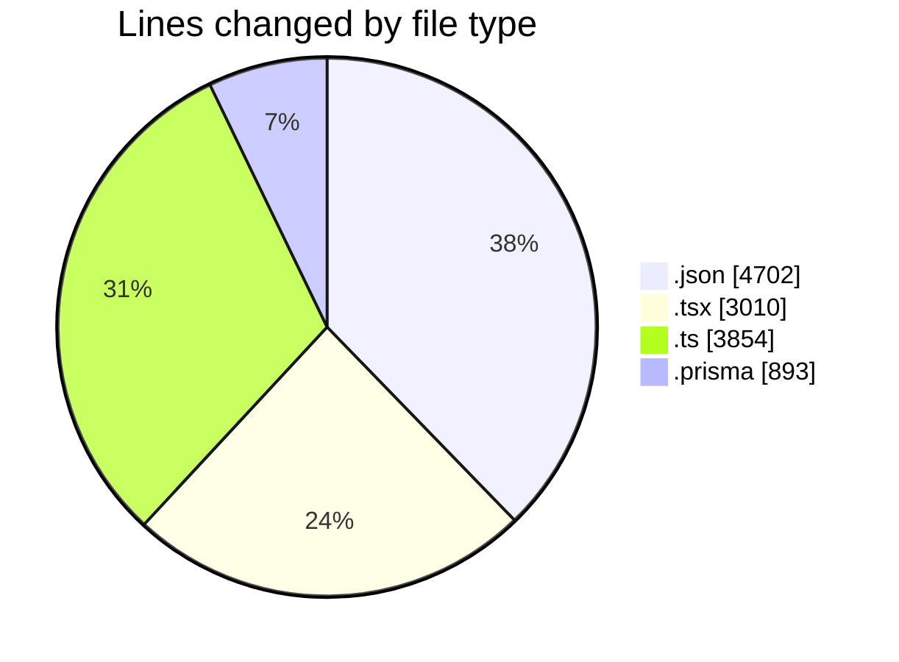
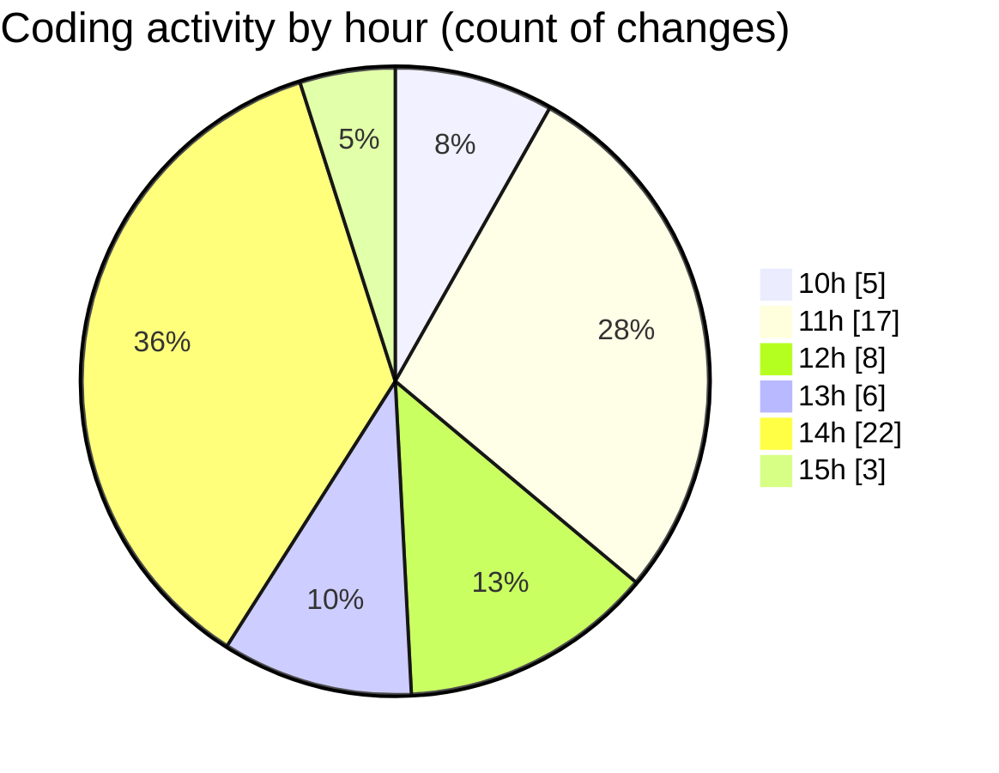

# ecodeli - Activity Summary 

## Overall Statistics

| Stat                   | Value                                                             |
| ---------------------- | ----------------------------------------------------------------- |
| **Lines Added** (➕)   | 12376                                          |
| **Lines Removed** (➖) | 83                                        |
| **Net Change** (↕)    | 12293                |
| **Active Time** (⌚)   | 91 minutes |

## Modified Files
- **package.json** (+5, -4)
- **page.tsx** (+518, -0)
- **fr.json** (+4501, -0)
- **middleware.ts** (+346, -2)
- **delivery-tracking.router.ts** (+98, -4)
- **announcement.router.ts** (+317, -8)
- **document.schema.ts** (+83, -0)
- **document.router.ts** (+477, -0)
- **document.service.ts** (+1135, -5)
- **deliverer-document-upload.tsx** (+309, -0)
- **document-list.tsx** (+294, -0)
- **use-documents.ts** (+123, -0)
- **schema.prisma** (+893, -0)
- **pending-user-verifications.tsx** (+197, -0)
- **verification.router.ts** (+407, -0)
- **page.tsx** (+49, -0)
- **page.tsx** (+61, -7)
- **user-document-verification.tsx** (+442, -3)
- **layout.tsx** (+85, -48)
- **fonts.ts** (+5, -0)
- **package.json** (+190, -2)
- **document.ts** (+36, -0)
- **enums.ts** (+48, -0)
- **document-upload.tsx** (+348, -0)
- **document-verification.tsx** (+343, -0)
- **notification.service.ts** (+760, -0)
- **document-verification.tsx** (+306, -0)

## Visualizations

### By File Type (Lines Changed)

### By Hour (Estimated Activity Count)

> **Last Updated:** 5/5/2025, 3:05:21 PM