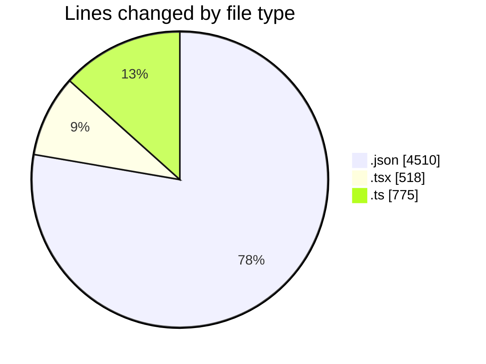
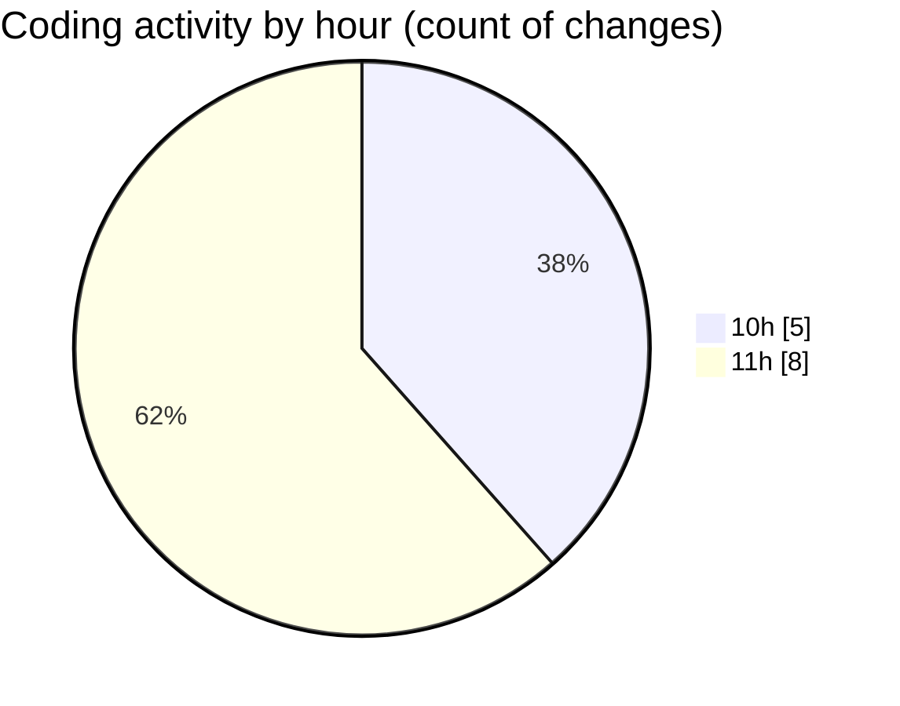

# ecodeli - Activity Summary 

## Overall Statistics

| Stat                   | Value                                                             |
| ---------------------- | ----------------------------------------------------------------- |
| **Lines Added** (➕)   | 5785                                          |
| **Lines Removed** (➖) | 18                                        |
| **Net Change** (↕)    | 5767                |
| **Active Time** (⌚)   | 16 minutes |

## Modified Files
- **package.json** (+5, -4)
- **page.tsx** (+518, -0)
- **fr.json** (+4501, -0)
- **middleware.ts** (+346, -2)
- **delivery-tracking.router.ts** (+98, -4)
- **announcement.router.ts** (+317, -8)

## Visualizations

### By File Type (Lines Changed)

### By Hour (Estimated Activity Count)

> **Last Updated:** 5/5/2025, 11:30:14 AM