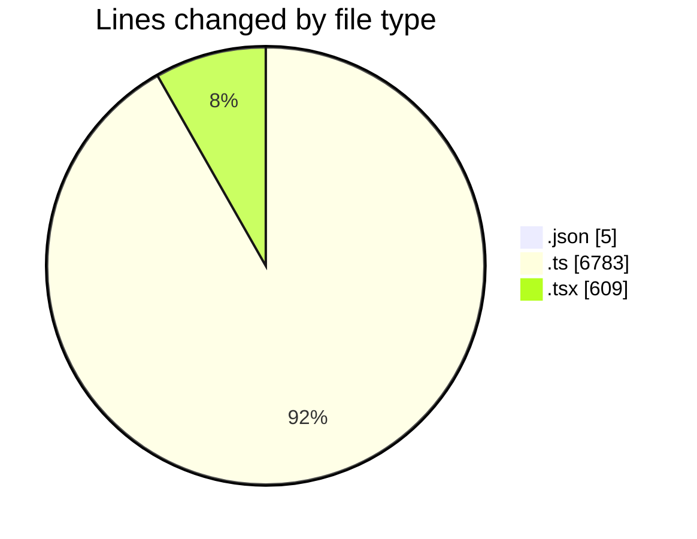
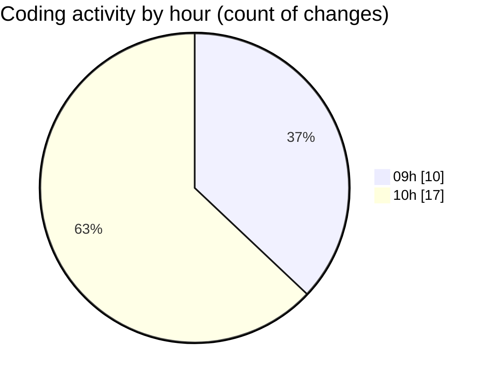

# ecodeli - Activity Summary 

## Overall Statistics

| Stat                   | Value                                                             |
| ---------------------- | ----------------------------------------------------------------- |
| **Lines Added** (➕)   | 6264                                          |
| **Lines Removed** (➖) | 1133                                        |
| **Net Change** (↕)    | 5131                |
| **Active Time** (⌚)   | 38 minutes |

## Modified Files
- **package.json** (+3, -2)
- **seed.ts** (+2241, -0)
- **route.ts** (+180, -43)
- **document.router.ts** (+510, -0)
- **use-documents.ts** (+143, -0)
- **user-document-verification.tsx** (+565, -44)
- **document.service.ts** (+2153, -1016)
- **route.ts** (+90, -0)
- **use-document-upload.ts** (+263, -19)
- **document.schema.ts** (+116, -9)

## Visualizations

### By File Type (Lines Changed)

### By Hour (Estimated Activity Count)

> **Last Updated:** 5/9/2025, 10:58:39 AM