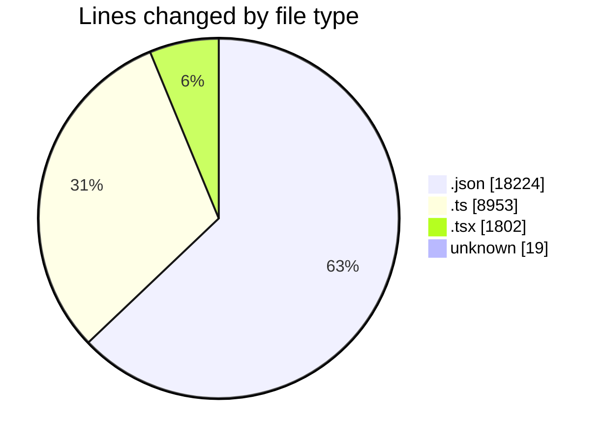
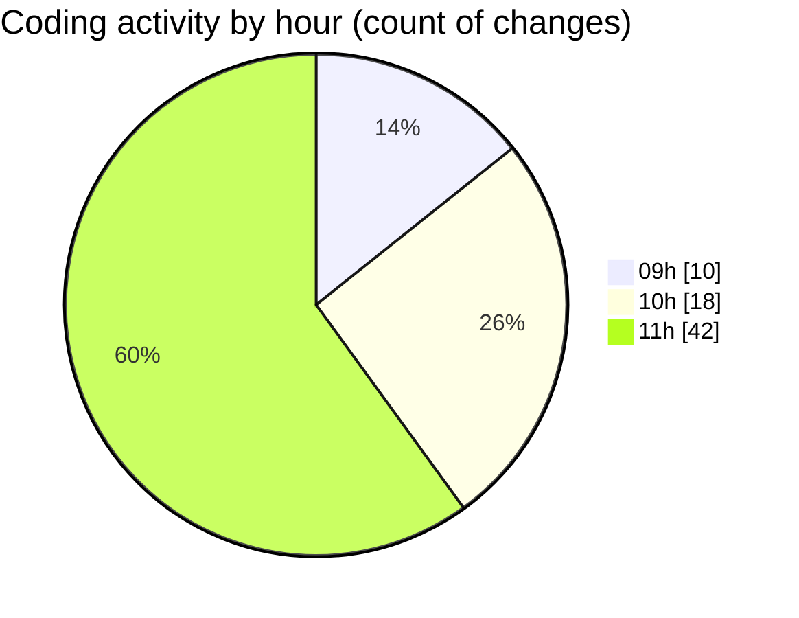

# ecodeli - Activity Summary 

## Overall Statistics

| Stat                   | Value                                                             |
| ---------------------- | ----------------------------------------------------------------- |
| **Lines Added** (➕)   | 27505                                          |
| **Lines Removed** (➖) | 1493                                        |
| **Net Change** (↕)    | 26012                |
| **Active Time** (⌚)   | 90 minutes |

## Modified Files
- **package.json** (+3, -2)
- **seed.ts** (+2241, -0)
- **route.ts** (+180, -43)
- **document.router.ts** (+1734, -159)
- **use-documents.ts** (+143, -0)
- **user-document-verification.tsx** (+1633, -70)
- **document.service.ts** (+2153, -1048)
- **route.ts** (+166, -14)
- **use-document-upload.ts** (+482, -44)
- **document.schema.ts** (+206, -26)
- **pre-commit** (+14, -5)
- **package-lock.json** (+17963, -68)
- **page.tsx** (+85, -14)
- **announcement.router.ts** (+314, -0)
- **package.json** (+188, -0)

## Visualizations

### By File Type (Lines Changed)

### By Hour (Estimated Activity Count)

> **Last Updated:** 5/9/2025, 11:46:26 AM