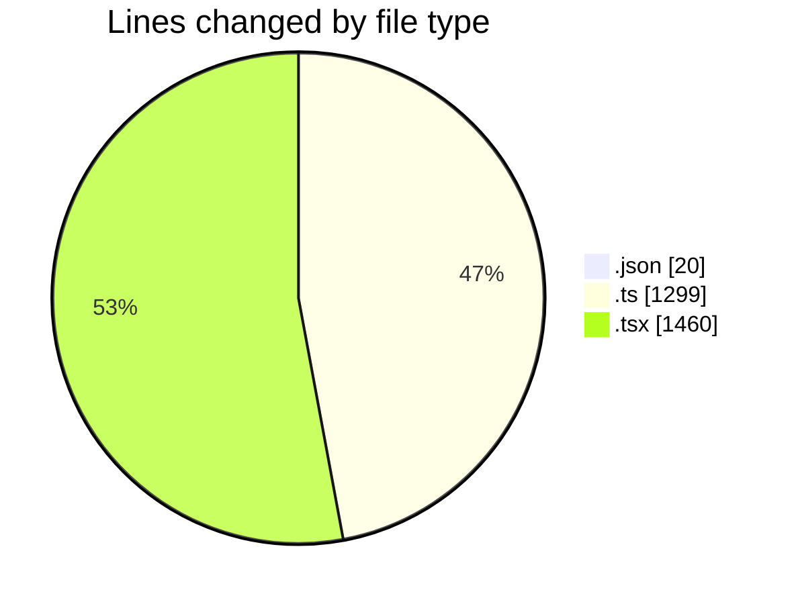
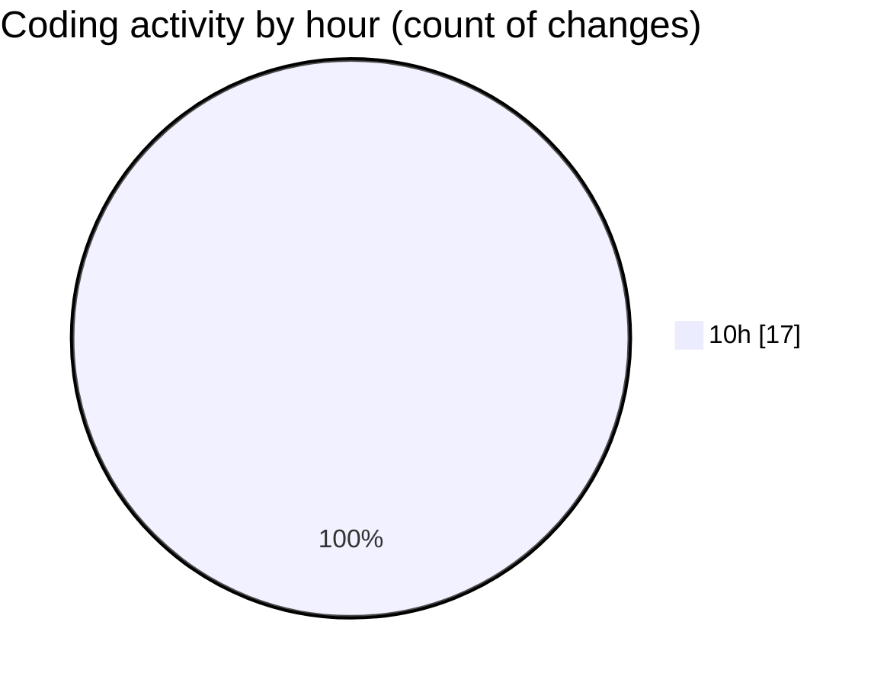

# ecodeli-1 - Activity Summary 

## Overall Statistics

| Stat                   | Value                                                             |
| ---------------------- | ----------------------------------------------------------------- |
| **Lines Added** (➕)   | 2775                                          |
| **Lines Removed** (➖) | 4                                        |
| **Net Change** (↕)    | 2771                |
| **Active Time** (⌚)   | 18 minutes |

## Modified Files
- **settings.json** (+20, -0)
- **admin.service.ts** (+807, -0)
- **user-filters.tsx** (+361, -0)
- **user-permissions-form.tsx** (+303, -0)
- **use-admin-users.ts** (+303, -0)
- **page.tsx** (+567, -4)
- **admin-user.router.ts** (+189, -0)
- **user-export.tsx** (+225, -0)

## Visualizations

### By File Type (Lines Changed)

### By Hour (Estimated Activity Count)

> **Last Updated:** 5/15/2025, 10:21:04 AM