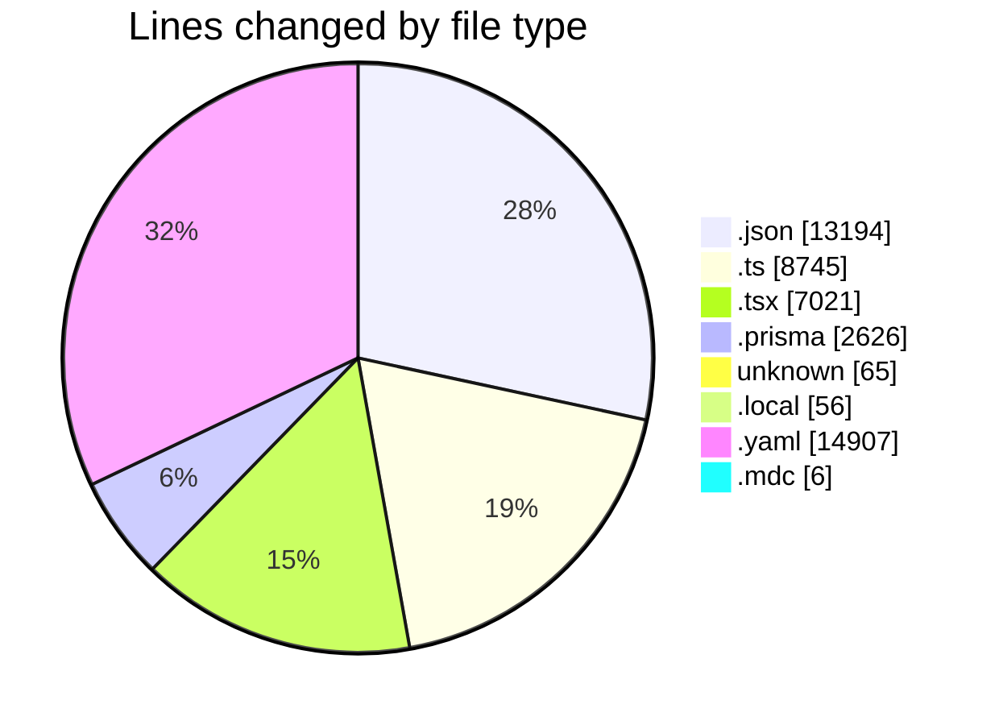
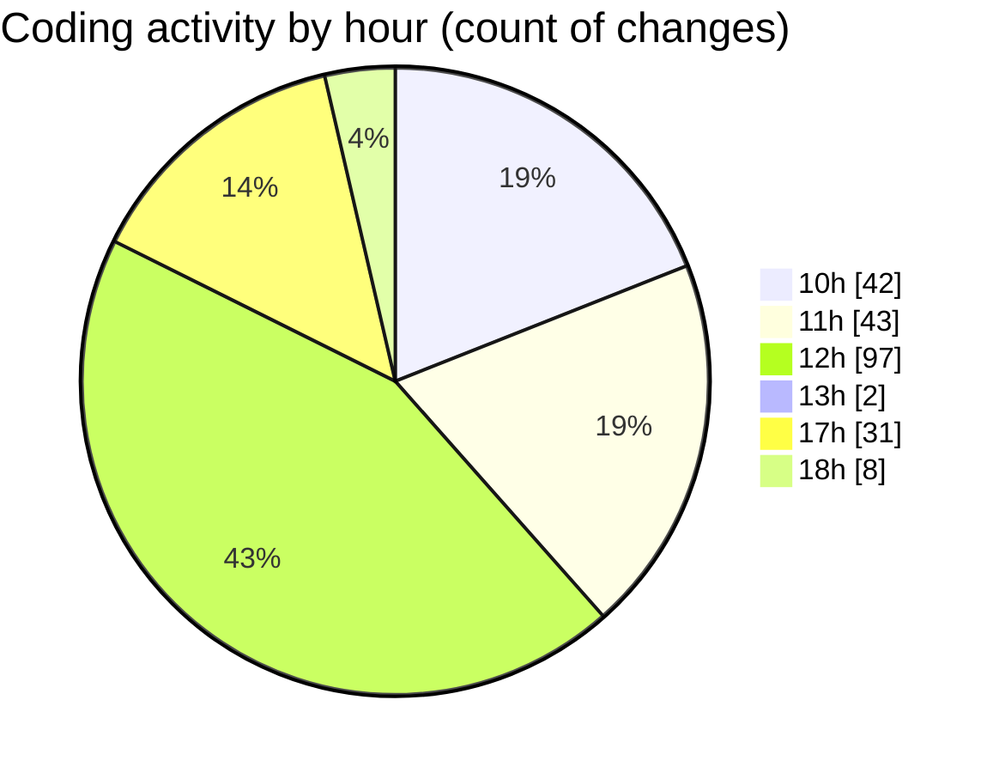

# ecodeli-1 - Activity Summary 

## Overall Statistics

| Stat                   | Value                                                             |
| ---------------------- | ----------------------------------------------------------------- |
| **Lines Added** (➕)   | 41383                                          |
| **Lines Removed** (➖) | 5237                                        |
| **Net Change** (↕)    | 36146                |
| **Active Time** (⌚)   | 309 minutes |

## Modified Files
- **settings.json** (+34, -0)
- **admin.service.ts** (+807, -20)
- **user-filters.tsx** (+361, -0)
- **user-permissions-form.tsx** (+303, -0)
- **use-admin-users.ts** (+303, -0)
- **page.tsx** (+567, -4)
- **admin-user.router.ts** (+189, -0)
- **user-export.tsx** (+225, -0)
- **page.tsx** (+167, -0)
- **schema.prisma** (+1730, -837)
- **minimal-seed.ts** (+41, -0)
- **minimal-schema.prisma** (+59, -0)
- **.env** (+14, -1)
- **.env.local** (+35, -21)
- **deliverer-register-form.tsx** (+324, -0)
- **route.ts** (+79, -0)
- **document.service.ts** (+2394, -399)
- **document.router.ts** (+1247, -67)
- **deliverer-document-upload.tsx** (+343, -26)
- **use-documents.ts** (+180, -67)
- **document-upload.tsx** (+350, -0)
- **document-upload-form.tsx** (+818, -614)
- **fr.json** (+6901, -2265)
- **document.schema.ts** (+120, -19)
- **route.ts** (+114, -4)
- **lucide-react.d.ts** (+1, -0)
- **pnpm-lock.yaml** (+14907, -0)
- **page.tsx** (+30, -0)
- **user-document-verification.tsx** (+1579, -844)
- **verification.router.ts** (+994, -0)
- **route.ts** (+86, -1)
- **route.ts** (+73, -1)
- **auth.ts** (+1, -0)
- **.gitignore** (+46, -4)
- **route.ts** (+172, -41)
- **auth.router.ts** (+709, -0)
- **enums.ts** (+49, -0)
- **package.json** (+3, -2)
- **verification.service.ts** (+454, -0)
- **auto-verification-checker.tsx** (+57, -0)
- **layout.tsx** (+39, -0)
- **deliverer-dashboard.tsx** (+209, -0)
- **webrulles.mdc** (+6, -0)
- **en.json** (+3989, -0)
- **root.ts** (+79, -0)
- **payment.service.ts** (+34, -0)
- **force-verification-update.tsx** (+67, -0)
- **page.tsx** (+94, -0)

## Visualizations

### By File Type (Lines Changed)

### By Hour (Estimated Activity Count)

> **Last Updated:** 5/15/2025, 6:17:07 PM