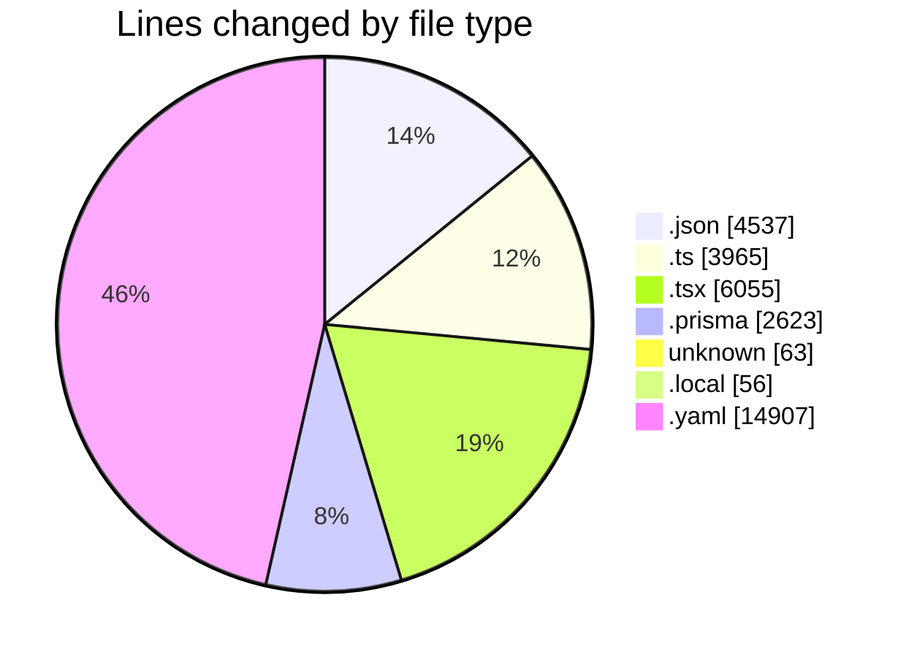
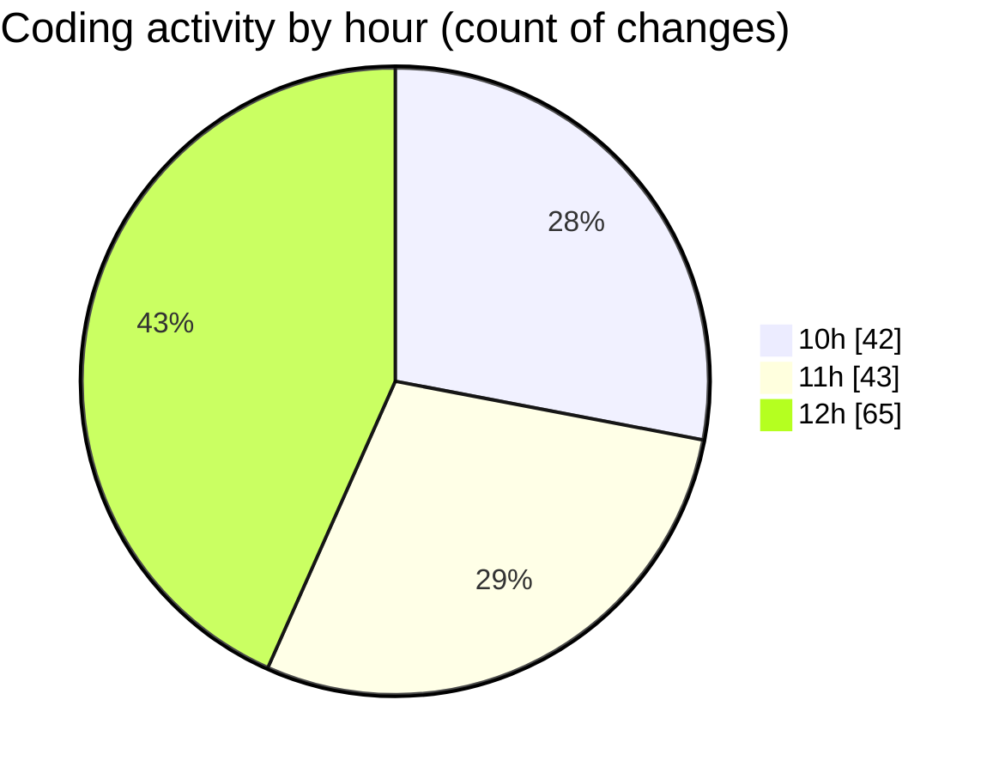

# ecodeli-1 - Activity Summary 

## Overall Statistics

| Stat                   | Value                                                             |
| ---------------------- | ----------------------------------------------------------------- |
| **Lines Added** (➕)   | 30042                                          |
| **Lines Removed** (➖) | 2164                                        |
| **Net Change** (↕)    | 27878                |
| **Active Time** (⌚)   | 212 minutes |

## Modified Files
- **settings.json** (+34, -0)
- **admin.service.ts** (+807, -20)
- **user-filters.tsx** (+361, -0)
- **user-permissions-form.tsx** (+303, -0)
- **use-admin-users.ts** (+303, -0)
- **page.tsx** (+567, -4)
- **admin-user.router.ts** (+189, -0)
- **user-export.tsx** (+225, -0)
- **page.tsx** (+167, -0)
- **schema.prisma** (+1728, -836)
- **minimal-seed.ts** (+41, -0)
- **minimal-schema.prisma** (+59, -0)
- **.env** (+14, -1)
- **.env.local** (+35, -21)
- **deliverer-register-form.tsx** (+324, -0)
- **route.ts** (+79, -0)
- **document.service.ts** (+1182, -2)
- **document.router.ts** (+351, -6)
- **deliverer-document-upload.tsx** (+343, -26)
- **use-documents.ts** (+168, -25)
- **document-upload.tsx** (+350, -0)
- **document-upload-form.tsx** (+782, -578)
- **fr.json** (+4502, -1)
- **document.schema.ts** (+99, -9)
- **route.ts** (+114, -0)
- **lucide-react.d.ts** (+1, -0)
- **pnpm-lock.yaml** (+14907, -0)
- **page.tsx** (+30, -0)
- **user-document-verification.tsx** (+1365, -630)
- **verification.router.ts** (+407, -0)
- **route.ts** (+86, -1)
- **route.ts** (+73, -1)
- **auth.ts** (+1, -0)
- **.gitignore** (+45, -3)

## Visualizations

### By File Type (Lines Changed)

### By Hour (Estimated Activity Count)

> **Last Updated:** 5/15/2025, 12:41:10 PM