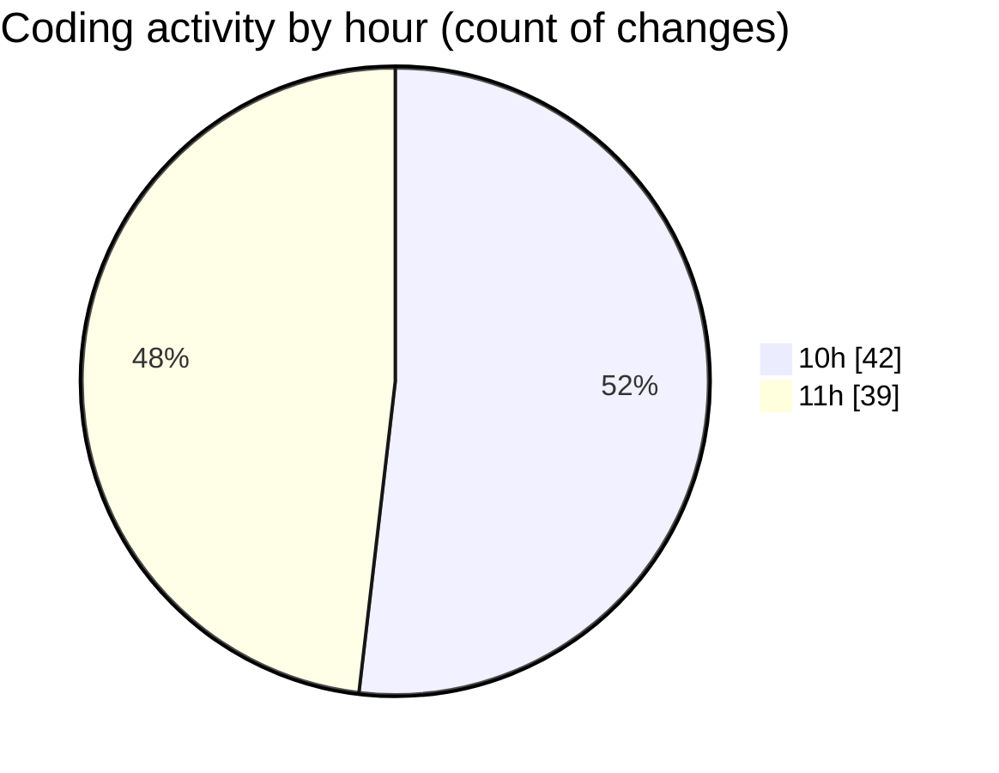

# ecodeli-1 - Activity Summary 

## Overall Statistics

| Stat                   | Value                                                             |
| ---------------------- | ----------------------------------------------------------------- |
| **Lines Added** (➕)   | 12470                                          |
| **Lines Removed** (➖) | 1014                                        |
| **Net Change** (↕)    | 11456                |
| **Active Time** (⌚)   | 105 minutes |

## Modified Files
- **settings.json** (+34, -0)
- **admin.service.ts** (+807, -0)
- **user-filters.tsx** (+361, -0)
- **user-permissions-form.tsx** (+303, -0)
- **use-admin-users.ts** (+303, -0)
- **page.tsx** (+567, -4)
- **admin-user.router.ts** (+189, -0)
- **user-export.tsx** (+225, -0)
- **page.tsx** (+167, -0)
- **schema.prisma** (+1725, -833)
- **minimal-seed.ts** (+41, -0)
- **minimal-schema.prisma** (+59, -0)
- **.env** (+14, -1)
- **.env.local** (+35, -21)
- **deliverer-register-form.tsx** (+324, -0)
- **route.ts** (+79, -0)
- **document.service.ts** (+1107, -0)
- **document.router.ts** (+351, -6)
- **deliverer-document-upload.tsx** (+335, -7)
- **use-documents.ts** (+126, -20)
- **document-upload.tsx** (+350, -0)
- **document-upload-form.tsx** (+377, -121)
- **fr.json** (+4502, -1)
- **document.schema.ts** (+89, -0)

## Visualizations

### By File Type (Lines Changed)

### By Hour (Estimated Activity Count)

> **Last Updated:** 5/15/2025, 11:56:07 AM