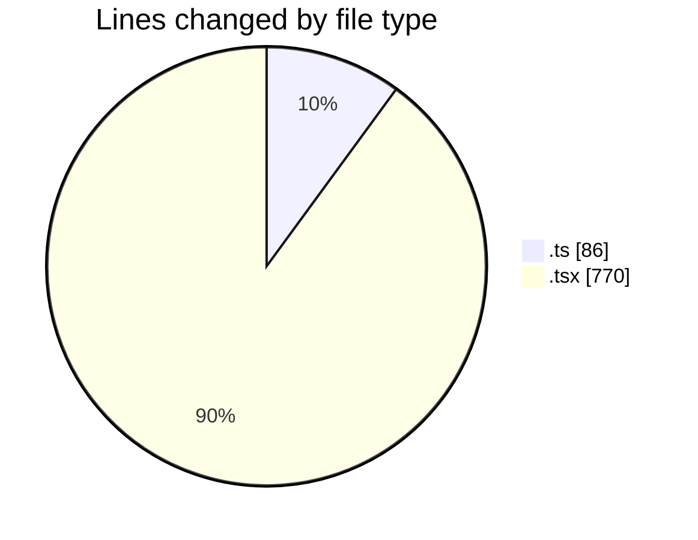
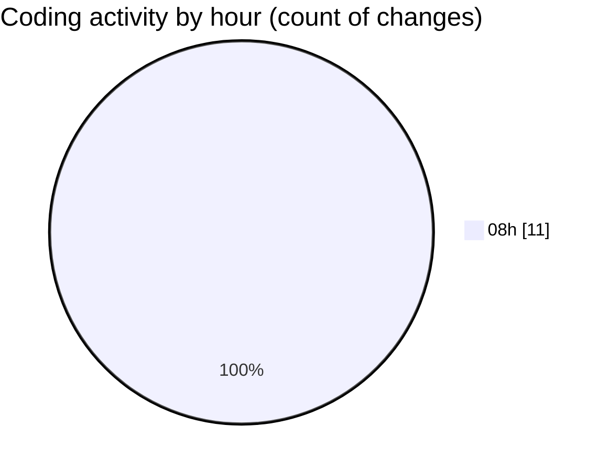

# ecodeli-1 - Activity Summary 

## Overall Statistics

| Stat                   | Value                                                             |
| ---------------------- | ----------------------------------------------------------------- |
| **Lines Added** (➕)   | 856                                          |
| **Lines Removed** (➖) | 0                                        |
| **Net Change** (↕)    | 856                |
| **Active Time** (⌚)   | 10 minutes |

## Modified Files
- **verification.router.ts** (+86, -0)
- **page.tsx** (+574, -0)
- **force-activate-deliverer-button.tsx** (+85, -0)
- **page.tsx** (+21, -0)
- **force-verify-deliverer-button.tsx** (+90, -0)

## Visualizations

### By File Type (Lines Changed)

### By Hour (Estimated Activity Count)

> **Last Updated:** 5/16/2025, 8:07:10 AM