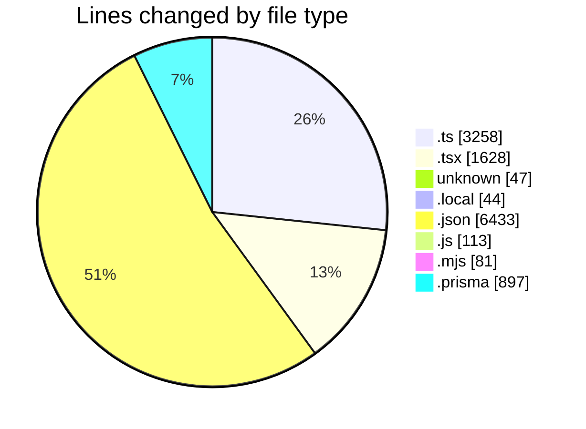
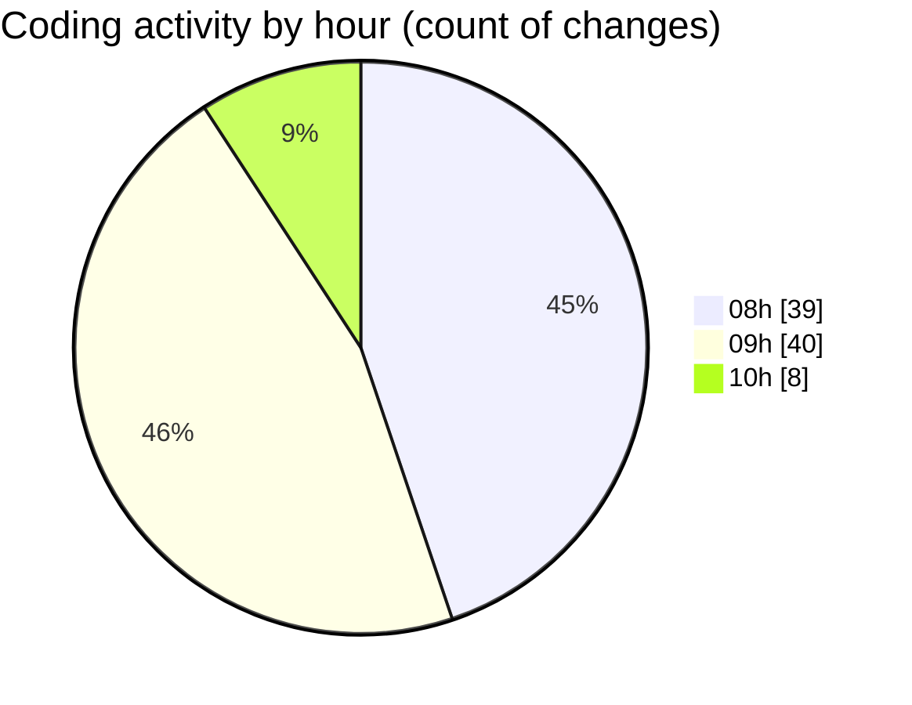

# ecodeli-1 - Activity Summary 

## Overall Statistics

| Stat                   | Value                                                             |
| ---------------------- | ----------------------------------------------------------------- |
| **Lines Added** (➕)   | 12427                                          |
| **Lines Removed** (➖) | 74                                        |
| **Net Change** (↕)    | 12353                |
| **Active Time** (⌚)   | 113 minutes |

## Modified Files
- **verification.router.ts** (+86, -0)
- **page.tsx** (+574, -0)
- **force-activate-deliverer-button.tsx** (+85, -0)
- **page.tsx** (+21, -0)
- **force-verify-deliverer-button.tsx** (+90, -0)
- **providers.tsx** (+43, -23)
- **layout.tsx** (+55, -0)
- **.env** (+34, -13)
- **.env.local** (+32, -12)
- **onboarding-controller.tsx** (+104, -0)
- **onboarding-context.tsx** (+181, -0)
- **email.service.ts** (+316, -0)
- **route.ts** (+47, -0)
- **email-verification.tsx** (+102, -0)
- **fr.json** (+2406, -0)
- **en.json** (+4019, -0)
- **mcp.json** (+8, -0)
- **auth.router.ts** (+788, -9)
- **use-auth.ts** (+300, -0)
- **login-form.tsx** (+350, -0)
- **email.ts** (+367, -1)
- **setup-env.js** (+49, -0)
- **setup-env.mjs** (+65, -16)
- **schema.prisma** (+897, -0)
- **migrate.js** (+64, -0)
- **auth.service.ts** (+1344, -0)

## Visualizations

### By File Type (Lines Changed)

### By Hour (Estimated Activity Count)

> **Last Updated:** 5/16/2025, 10:13:43 AM