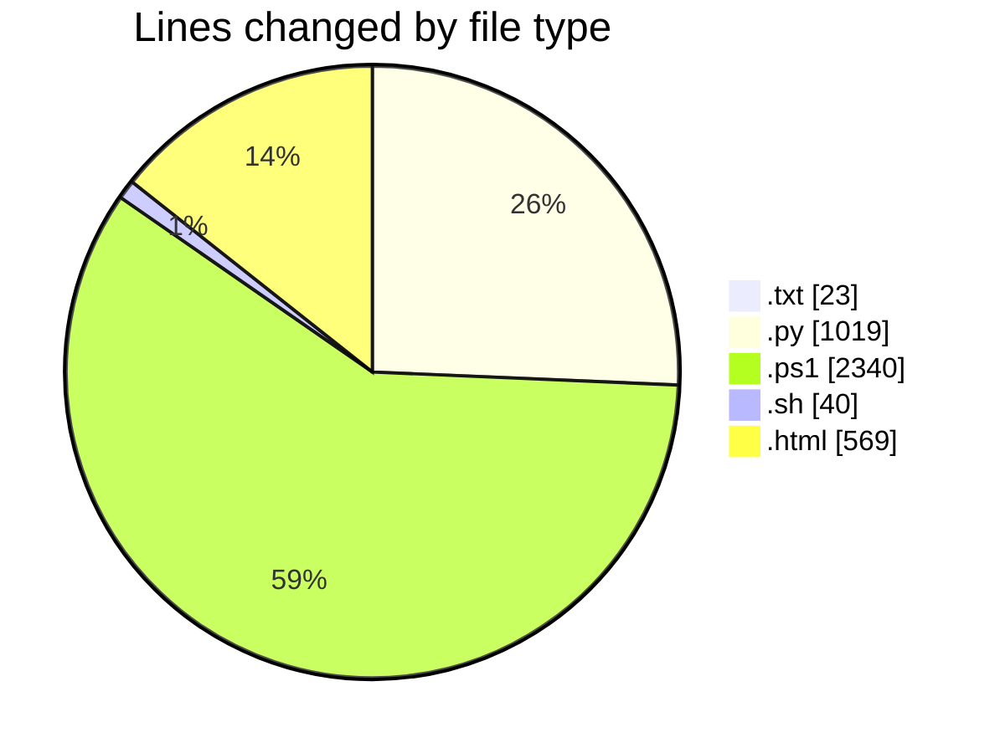
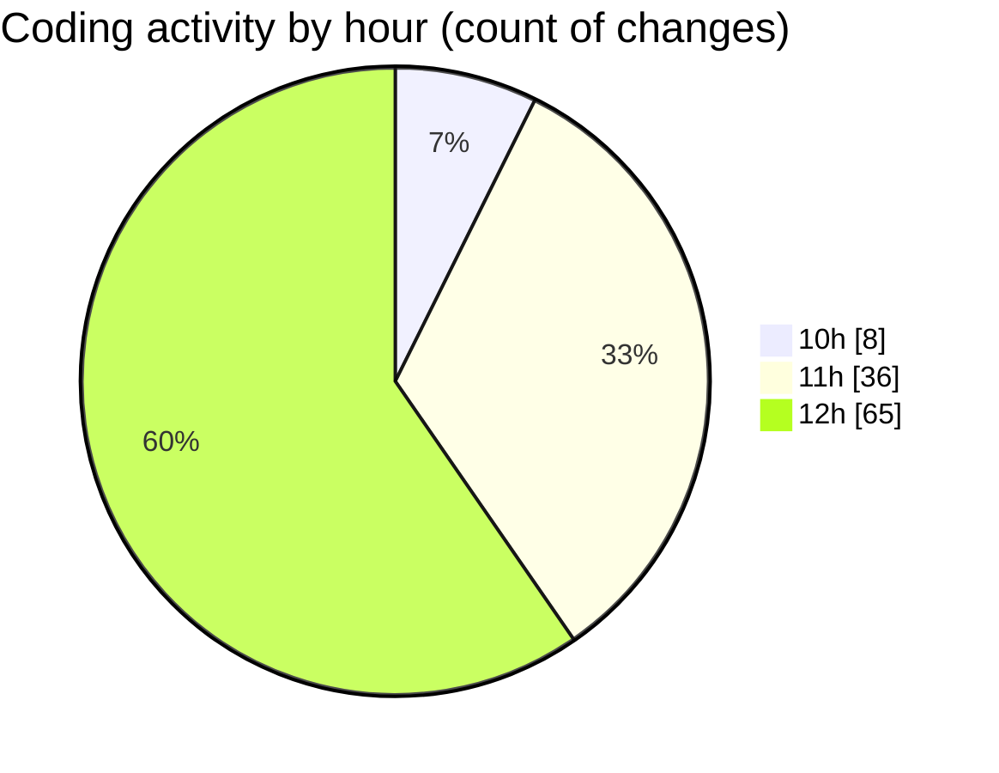

# python_app_deploy - Activity Summary 

## Overall Statistics

| Stat                   | Value                                                             |
| ---------------------- | ----------------------------------------------------------------- |
| **Lines Added** (➕)   | 2587                                          |
| **Lines Removed** (➖) | 1404                                        |
| **Net Change** (↕)    | 1183                |
| **Active Time** (⌚)   | 141 minutes |

## Modified Files
- **requirements.txt** (+8, -3)
- **app.py** (+551, -154)
- **deploy.ps1** (+159, -63)
- **restart.ps1** (+155, -21)
- **startup.txt** (+7, -5)
- **deploy.sh** (+40, -0)
- **check_service.ps1** (+73, -0)
- **update_cors.ps1** (+102, -32)
- **index.html** (+276, -32)
- **redeploy.ps1** (+58, -0)
- **test_cors.ps1** (+63, -10)
- **cors_test_options.ps1** (+101, -100)
- **fix_cors_options.ps1** (+119, -118)
- **app_cors_fix.py** (+44, -43)
- **deploy_simplified_cors.ps1** (+84, -83)
- **cors_test.html** (+131, -130)
- **minimal_app.py** (+114, -113)
- **deploy_minimal_app.ps1** (+230, -229)
- **test_cors_status.ps1** (+73, -72)
- **simple_options_test.ps1** (+46, -45)
- **options_test_to_file.ps1** (+92, -91)
- **minimal_test.ps1** (+61, -60)

## Visualizations

### By File Type (Lines Changed)

### By Hour (Estimated Activity Count)

> **Last Updated:** 5/16/2025, 12:35:42 PM