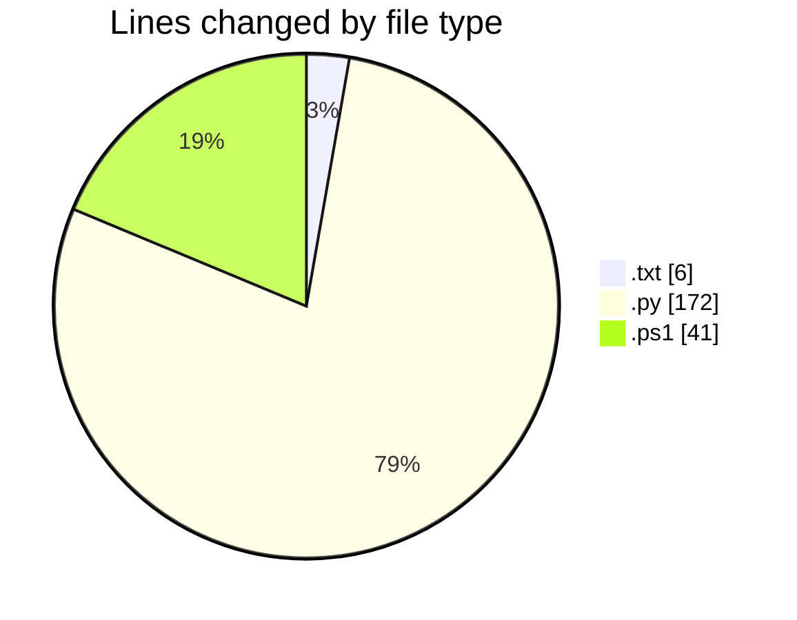
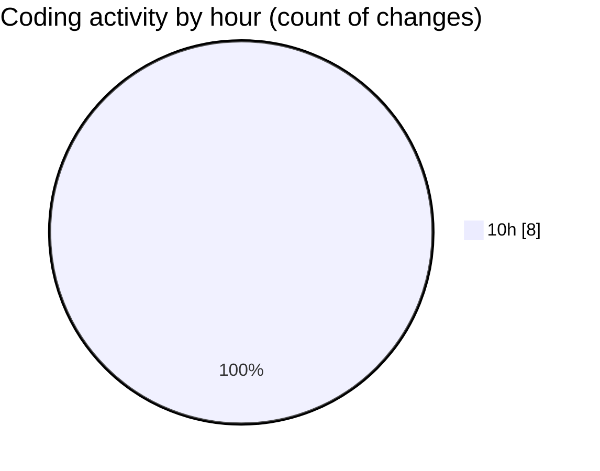

# python_app_deploy - Activity Summary 

## Overall Statistics

| Stat                   | Value                                                             |
| ---------------------- | ----------------------------------------------------------------- |
| **Lines Added** (➕)   | 189                                          |
| **Lines Removed** (➖) | 30                                        |
| **Net Change** (↕)    | 159                |
| **Active Time** (⌚)   | 7 minutes |

## Modified Files
- **requirements.txt** (+6, -0)
- **app.py** (+142, -30)
- **deploy.ps1** (+41, -0)

## Visualizations

### By File Type (Lines Changed)

### By Hour (Estimated Activity Count)

> **Last Updated:** 5/16/2025, 11:03:14 AM