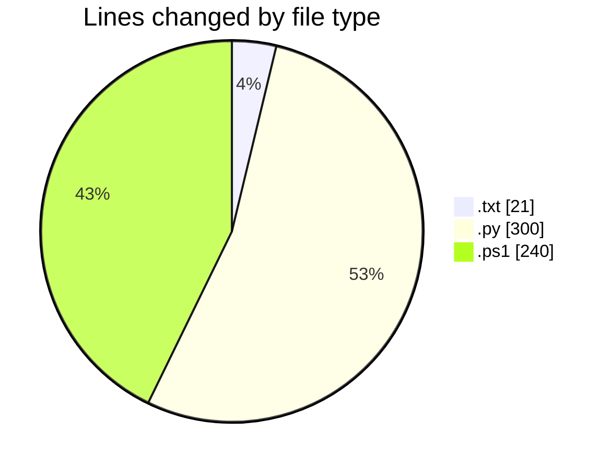
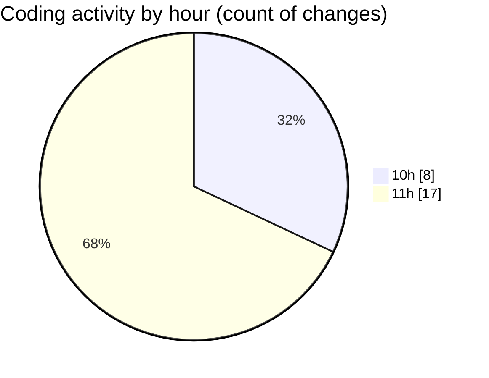

# python_app_deploy - Activity Summary 

## Overall Statistics

| Stat                   | Value                                                             |
| ---------------------- | ----------------------------------------------------------------- |
| **Lines Added** (➕)   | 498                                          |
| **Lines Removed** (➖) | 63                                        |
| **Net Change** (↕)    | 435                |
| **Active Time** (⌚)   | 27 minutes |

## Modified Files
- **requirements.txt** (+8, -3)
- **app.py** (+264, -36)
- **deploy.ps1** (+64, -0)
- **restart.ps1** (+155, -21)
- **startup.txt** (+7, -3)

## Visualizations

### By File Type (Lines Changed)

### By Hour (Estimated Activity Count)

> **Last Updated:** 5/16/2025, 11:33:14 AM