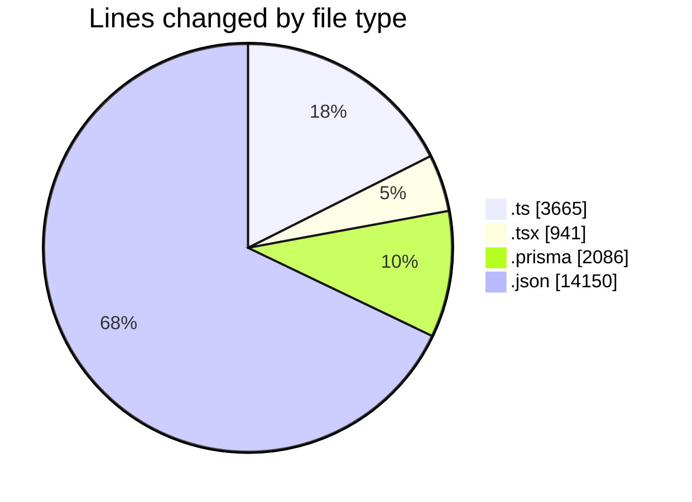
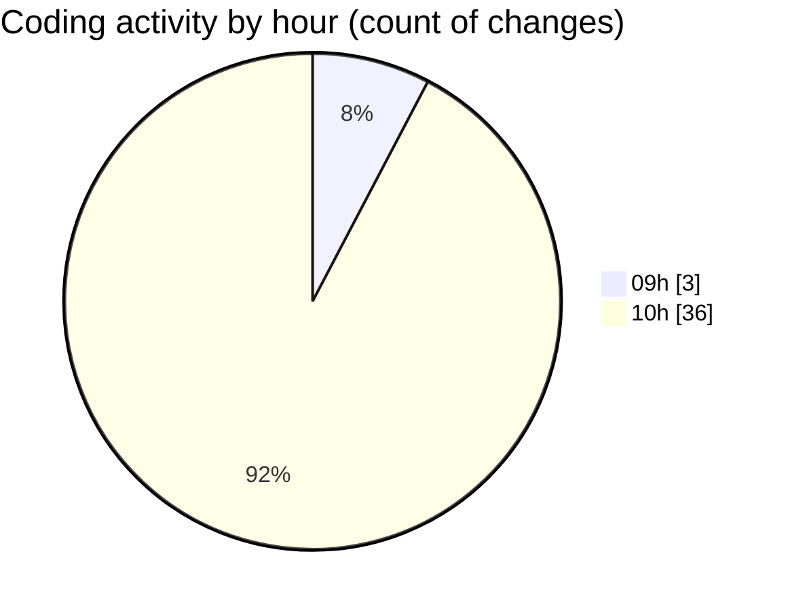

# ecodeli-1 - Activity Summary 

## Overall Statistics

| Stat                   | Value                                                             |
| ---------------------- | ----------------------------------------------------------------- |
| **Lines Added** (➕)   | 16790                                          |
| **Lines Removed** (➖) | 4052                                        |
| **Net Change** (↕)    | 12738                |
| **Active Time** (⌚)   | 46 minutes |

## Modified Files
- **auth.service.ts** (+1377, -45)
- **force-activate-deliverer-button.tsx** (+85, -0)
- **schema.prisma** (+2083, -3)
- **page.tsx** (+138, -0)
- **email-verification.tsx** (+115, -3)
- **onboarding-controller.tsx** (+152, -8)
- **root.ts** (+73, -3)
- **verification.router.ts** (+779, -12)
- **document.service.ts** (+1188, -188)
- **en.json** (+7787, -3765)
- **package.json** (+189, -0)
- **fr.json** (+2409, -0)
- **login-form.tsx** (+415, -25)

## Visualizations

### By File Type (Lines Changed)

### By Hour (Estimated Activity Count)

> **Last Updated:** 5/19/2025, 10:50:49 AM