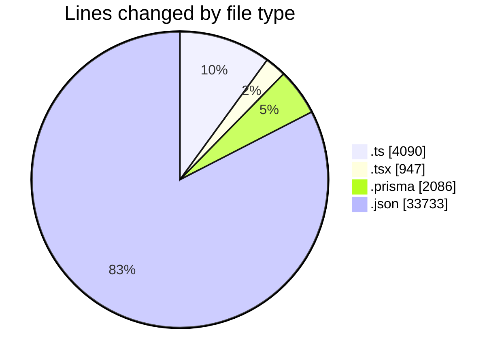
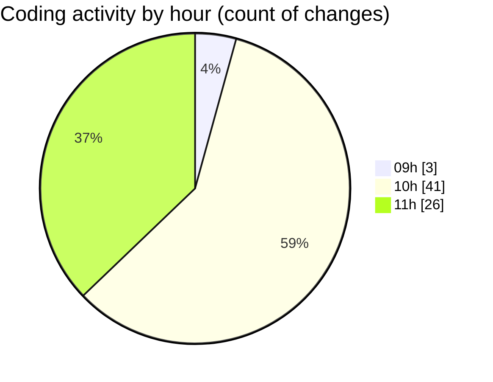

# ecodeli-1 - Activity Summary 

## Overall Statistics

| Stat                   | Value                                                             |
| ---------------------- | ----------------------------------------------------------------- |
| **Lines Added** (➕)   | 28671                                          |
| **Lines Removed** (➖) | 12185                                        |
| **Net Change** (↕)    | 16486                |
| **Active Time** (⌚)   | 94 minutes |

## Modified Files
- **auth.service.ts** (+1377, -45)
- **force-activate-deliverer-button.tsx** (+85, -0)
- **schema.prisma** (+2083, -3)
- **page.tsx** (+138, -0)
- **email-verification.tsx** (+115, -3)
- **onboarding-controller.tsx** (+152, -8)
- **root.ts** (+73, -3)
- **verification.router.ts** (+779, -12)
- **document.service.ts** (+1188, -188)
- **en.json** (+13986, -6660)
- **package.json** (+321, -53)
- **fr.json** (+7532, -5181)
- **login-form.tsx** (+417, -29)
- **register.schema.ts** (+75, -0)
- **deliverer-register.schema.ts** (+29, -0)
- **client-register.schema.ts** (+24, -0)
- **merchant-register.schema.ts** (+39, -0)
- **provider-register.schema.ts** (+50, -0)
- **stripe.service.ts** (+208, -0)

## Visualizations

### By File Type (Lines Changed)

### By Hour (Estimated Activity Count)

> **Last Updated:** 5/19/2025, 11:55:56 AM