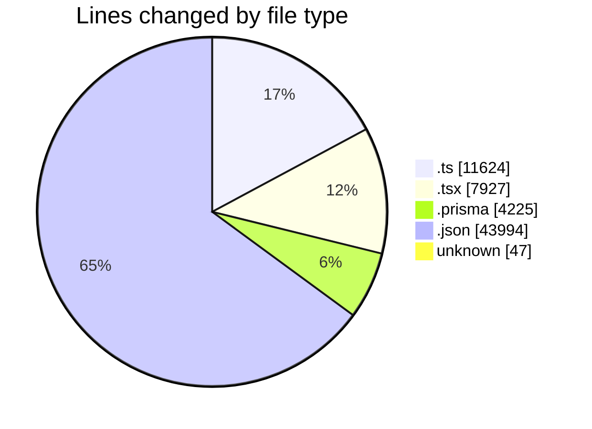
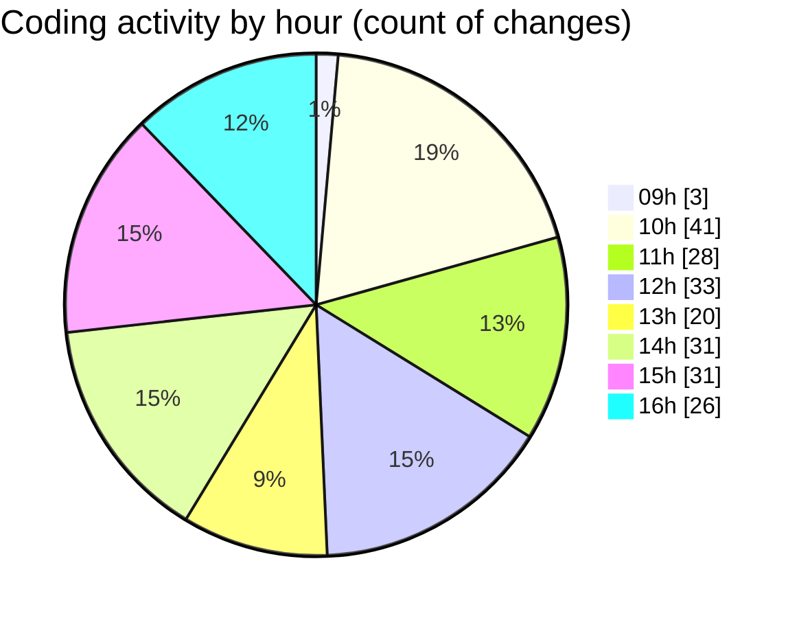

# ecodeli-1 - Activity Summary 

## Overall Statistics

| Stat                   | Value                                                             |
| ---------------------- | ----------------------------------------------------------------- |
| **Lines Added** (➕)   | 54630                                          |
| **Lines Removed** (➖) | 13187                                        |
| **Net Change** (↕)    | 41443                |
| **Active Time** (⌚)   | 323 minutes |

## Modified Files
- **auth.service.ts** (+1377, -45)
- **force-activate-deliverer-button.tsx** (+85, -0)
- **schema.prisma** (+4121, -3)
- **page.tsx** (+227, -54)
- **email-verification.tsx** (+115, -3)
- **onboarding-controller.tsx** (+159, -9)
- **root.ts** (+73, -3)
- **verification.router.ts** (+1048, -390)
- **document.service.ts** (+1291, -191)
- **en.json** (+21324, -6660)
- **package.json** (+321, -53)
- **fr.json** (+10355, -5263)
- **login-form.tsx** (+417, -29)
- **register.schema.ts** (+75, -0)
- **deliverer-register.schema.ts** (+29, -0)
- **client-register.schema.ts** (+24, -0)
- **merchant-register.schema.ts** (+39, -0)
- **provider-register.schema.ts** (+50, -0)
- **stripe.service.ts** (+208, -0)
- **auth.router.ts** (+790, -28)
- **token.service.ts** (+130, -0)
- **onboarding-context.tsx** (+189, -0)
- **tutorial-navigation.tsx** (+81, -0)
- **deliverer-sidebar.tsx** (+198, -0)
- **merchant-sidebar.tsx** (+208, -0)
- **provider-sidebar.tsx** (+200, -0)
- **client-sidebar.tsx** (+165, -9)
- **seed.ts** (+931, -0)
- **dashboard.service.ts** (+1734, -30)
- **UserStatsCard.tsx** (+107, -0)
- **deliverer-tutorial.tsx** (+142, -11)
- **auto-verification-checker.tsx** (+78, -2)
- **document.router.ts** (+539, -0)
- **deliverer-document-upload.tsx** (+313, -0)
- **force-verify-deliverer-button.tsx** (+191, -4)
- **layout.tsx** (+41, -0)
- **verification-status-provider.tsx** (+69, -0)
- **middleware.ts** (+353, -0)
- **next-auth.ts** (+248, -0)
- **page.tsx** (+482, -0)
- **utils.ts** (+255, -0)
- **delivery.ts** (+143, -11)
- **admin.service.ts** (+1349, -6)
- **layout.tsx** (+39, -0)
- **user-table.tsx** (+471, -172)
- **page.tsx** (+334, -0)
- **user-bulk-actions.tsx** (+1750, -0)
- **user-stats-advanced.tsx** (+729, -209)
- **document-verification-list.tsx** (+521, -0)
- **TodoList.tsx** (+83, -0)
- **page.tsx** (+31, -0)
- **use-todo.ts** (+65, -0)
- **settings.json** (+17, -1)
- **.gitignore** (+46, -1)
- **user.prisma** (+101, -0)
- **user.service.ts** (+49, -0)
- **user-activation.schema.ts** (+12, -0)
- **user.router.ts** (+54, -0)
- **use-user-activation.ts** (+54, -0)

## Visualizations

### By File Type (Lines Changed)

### By Hour (Estimated Activity Count)

> **Last Updated:** 5/19/2025, 4:29:30 PM