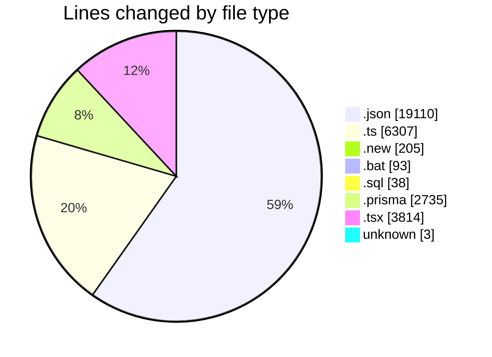
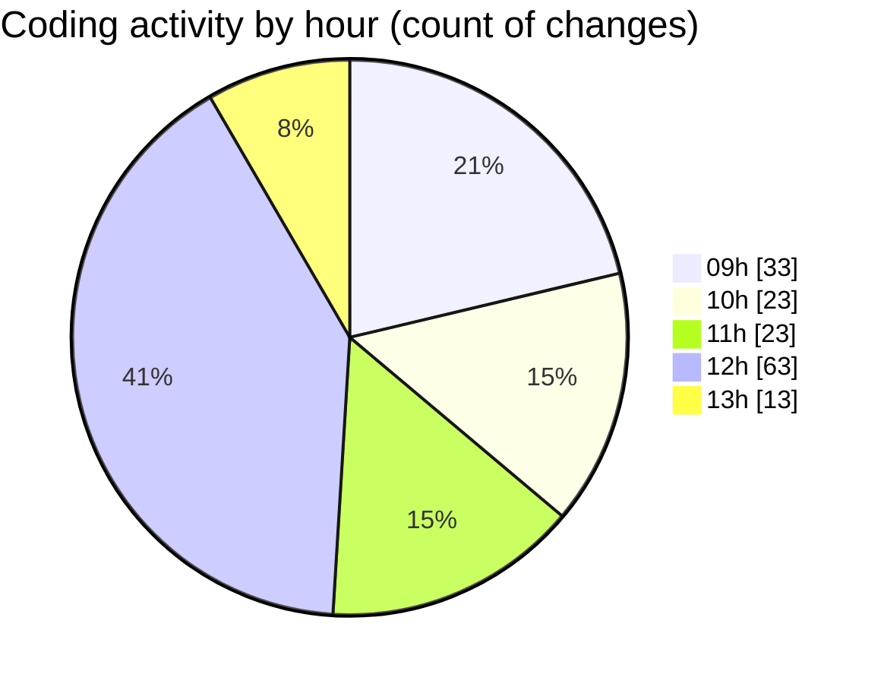

# ecodeli-1 - Activity Summary 

## Overall Statistics

| Stat                   | Value                                                             |
| ---------------------- | ----------------------------------------------------------------- |
| **Lines Added** (➕)   | 23153                                          |
| **Lines Removed** (➖) | 9152                                        |
| **Net Change** (↕)    | 14001                |
| **Active Time** (⌚)   | 225 minutes |

## Modified Files
- **fr-ban.json** (+33, -33)
- **user-ban.schema.ts** (+26, -14)
- **user.service.ts** (+178, -68)
- **user.service.ts.new** (+103, -102)
- **user.router.ts** (+37, -22)
- **apply-ban-migration.bat** (+47, -46)
- **add-user-ban-fields.sql** (+19, -19)
- **user.prisma** (+6, -0)
- **users-seed.ts** (+392, -0)
- **user.ts** (+27, -0)
- **use-user-ban.ts** (+73, -2)
- **user-bulk-actions.tsx** (+45, -5)
- **user-table.tsx** (+708, -11)
- **user.service.ban.test.ts** (+69, -0)
- **user.router.ban.test.ts** (+52, -0)
- **user-table-new.tsx** (+375, -374)
- **.gitignore** (+3, -0)
- **fr.json** (+2578, -156)
- **missing_translations.json** (+23, -22)
- **schema.prisma** (+2047, -4)
- **page.tsx** (+135, -51)
- **middleware.ts** (+379, -0)
- **page.tsx** (+53, -0)
- **admin.service.ts** (+1358, -13)
- **verifications.prisma** (+102, -0)
- **profile.prisma** (+171, -0)
- **enums.prisma** (+405, -0)
- **verification.ts** (+220, -62)
- **verification.schema.ts** (+153, -0)
- **verification.service.ts** (+828, -0)
- **merchant-register-form.tsx** (+316, -0)
- **provider-register-form.tsx** (+315, -0)
- **page.tsx** (+41, -0)
- **page.tsx** (+41, -0)
- **multi-select.tsx** (+131, -0)
- **page.tsx** (+73, -11)
- **page.tsx** (+73, -11)
- **use-verification.ts** (+158, -3)
- **verification.router.ts** (+763, -0)
- **react.ts** (+75, -50)
- **trpc-provider.tsx** (+40, -0)
- **use-verification-store.ts** (+120, -0)
- **document-upload.tsx** (+173, -3)
- **document-list.tsx** (+223, -0)
- **file-utils.ts** (+119, -0)
- **verification-form.tsx** (+219, -0)
- **page.tsx** (+98, -0)
- **merchant-verification-form.tsx** (+43, -0)
- **verification-status-banner.tsx** (+103, -0)
- **seed.ts** (+1046, -0)
- **provider-verification-form.tsx** (+43, -0)
- **page.tsx** (+100, -0)
- **en.json** (+8195, -8070)

## Visualizations

### By File Type (Lines Changed)

### By Hour (Estimated Activity Count)

> **Last Updated:** 5/20/2025, 1:20:55 PM