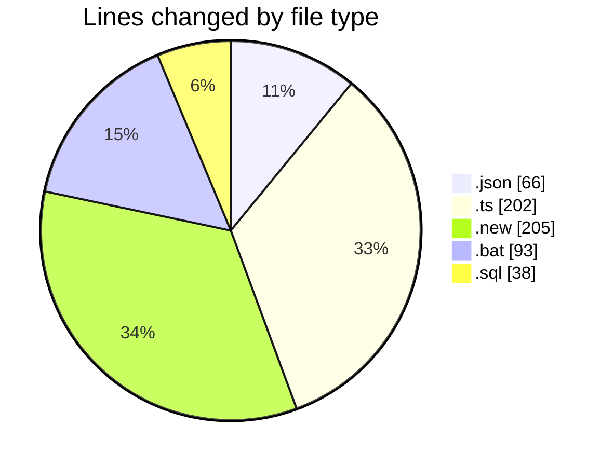

# ecodeli-1 - Activity Summary 

## Overall Statistics

| Stat                   | Value                                                             |
| ---------------------- | ----------------------------------------------------------------- |
| **Lines Added** (➕)   | 303                                          |
| **Lines Removed** (➖) | 301                                        |
| **Net Change** (↕)    | 2                |
| **Active Time** (⌚)   | 27 minutes |

## Modified Files
- **fr-ban.json** (+33, -33)
- **user-ban.schema.ts** (+14, -14)
- **user.service.ts** (+65, -65)
- **user.service.ts.new** (+103, -102)
- **user.router.ts** (+22, -22)
- **apply-ban-migration.bat** (+47, -46)
- **add-user-ban-fields.sql** (+19, -19)

## Visualizations

### By File Type (Lines Changed)

### By Hour (Estimated Activity Count)

> **Last Updated:** 5/20/2025, 9:43:34 AM