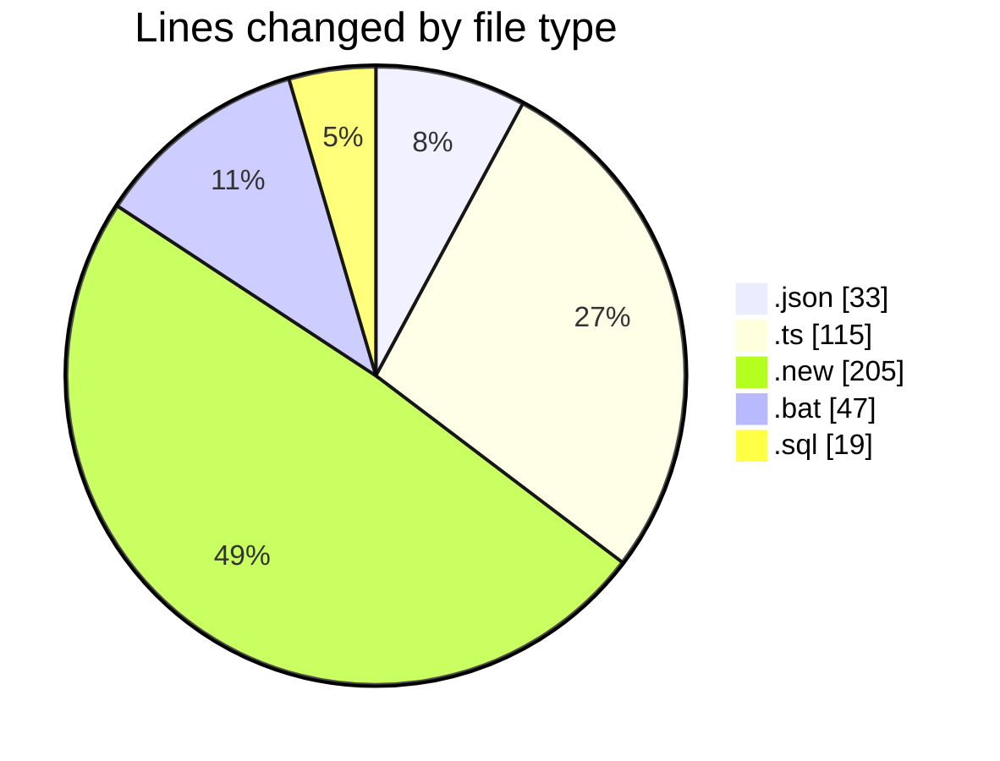
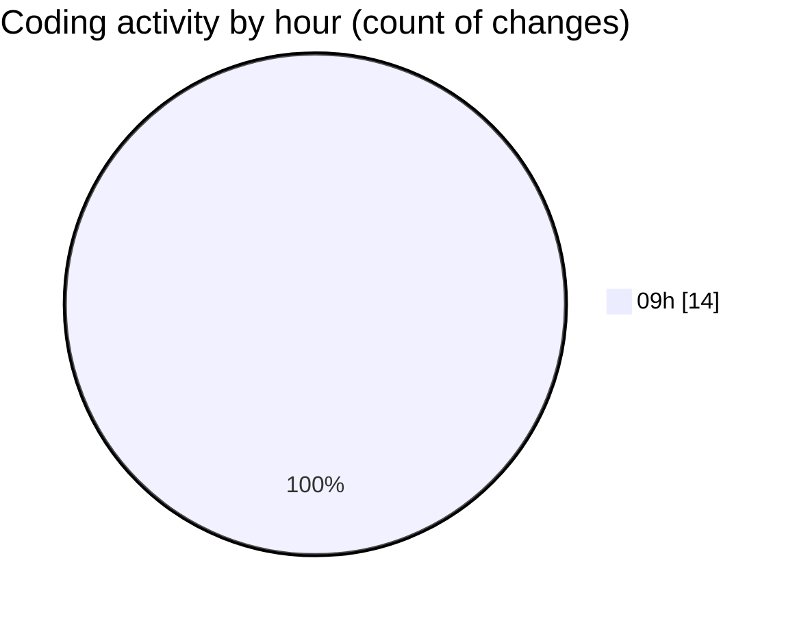

# ecodeli-1 - Activity Summary 

## Overall Statistics

| Stat                   | Value                                                             |
| ---------------------- | ----------------------------------------------------------------- |
| **Lines Added** (➕)   | 303                                          |
| **Lines Removed** (➖) | 116                                        |
| **Net Change** (↕)    | 187                |
| **Active Time** (⌚)   | 21 minutes |

## Modified Files
- **fr-ban.json** (+33, -0)
- **user-ban.schema.ts** (+14, -0)
- **user.service.ts** (+65, -11)
- **user.service.ts.new** (+103, -102)
- **user.router.ts** (+22, -3)
- **apply-ban-migration.bat** (+47, -0)
- **add-user-ban-fields.sql** (+19, -0)

## Visualizations

### By File Type (Lines Changed)

### By Hour (Estimated Activity Count)

> **Last Updated:** 5/20/2025, 9:38:34 AM