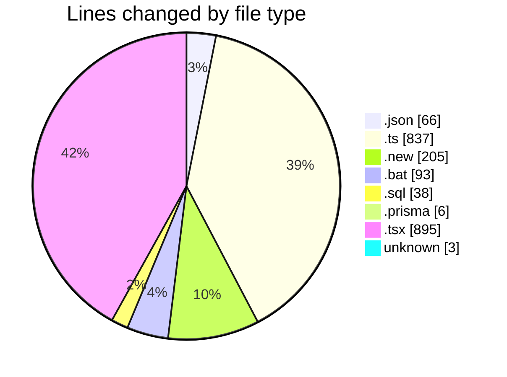
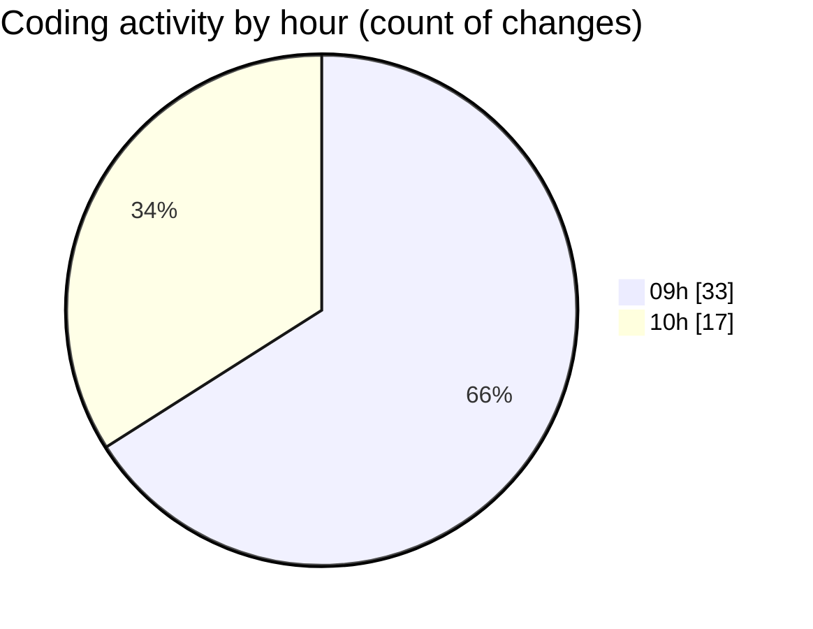

# ecodeli-1 - Activity Summary 

## Overall Statistics

| Stat                   | Value                                                             |
| ---------------------- | ----------------------------------------------------------------- |
| **Lines Added** (➕)   | 1452                                          |
| **Lines Removed** (➖) | 691                                        |
| **Net Change** (↕)    | 761                |
| **Active Time** (⌚)   | 78 minutes |

## Modified Files
- **fr-ban.json** (+33, -33)
- **user-ban.schema.ts** (+26, -14)
- **user.service.ts** (+97, -65)
- **user.service.ts.new** (+103, -102)
- **user.router.ts** (+37, -22)
- **apply-ban-migration.bat** (+47, -46)
- **add-user-ban-fields.sql** (+19, -19)
- **user.prisma** (+6, -0)
- **users-seed.ts** (+392, -0)
- **user.ts** (+27, -0)
- **use-user-ban.ts** (+36, -0)
- **user-bulk-actions.tsx** (+45, -5)
- **user-table.tsx** (+85, -11)
- **user.service.ban.test.ts** (+69, -0)
- **user.router.ban.test.ts** (+52, -0)
- **user-table-new.tsx** (+375, -374)
- **.gitignore** (+3, -0)

## Visualizations

### By File Type (Lines Changed)

### By Hour (Estimated Activity Count)

> **Last Updated:** 5/20/2025, 10:38:50 AM