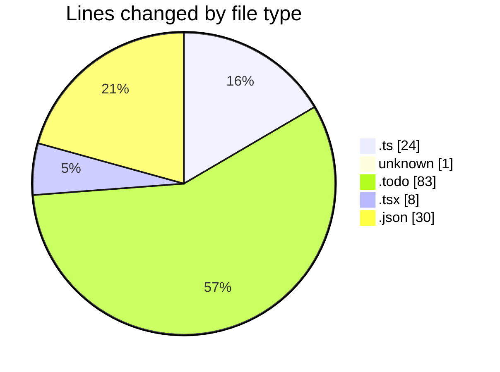
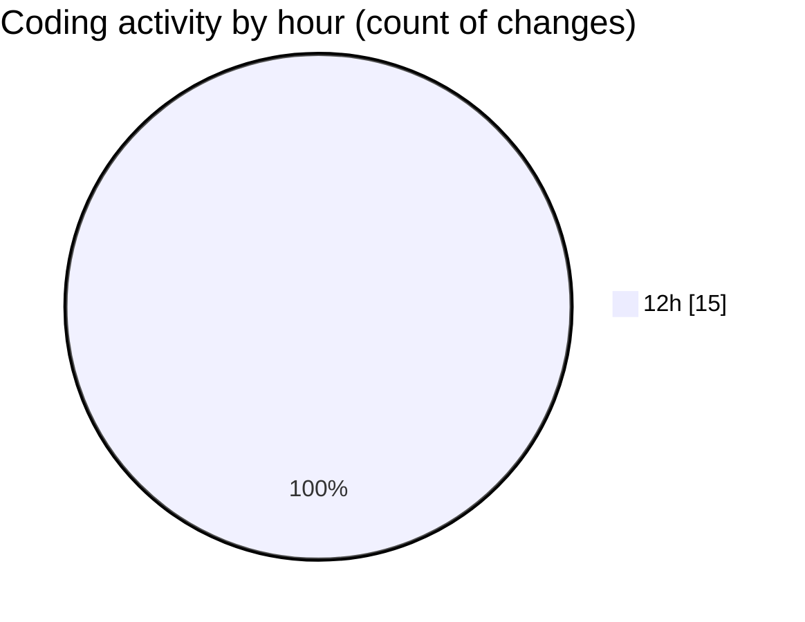

# ecodeli-1 - Activity Summary 

## Overall Statistics

| Stat                   | Value                                                             |
| ---------------------- | ----------------------------------------------------------------- |
| **Lines Added** (➕)   | 105                                          |
| **Lines Removed** (➖) | 41                                        |
| **Net Change** (↕)    | 64                |
| **Active Time** (⌚)   | 18 minutes |

## Modified Files
- **seed.ts** (+0, -24)
- **.gitignore** (+1, -0)
- **todo.todo** (+76, -7)
- **page.tsx** (+8, -0)
- **fr.json** (+20, -10)

## Visualizations

### By File Type (Lines Changed)

### By Hour (Estimated Activity Count)

> **Last Updated:** 5/21/2025, 12:35:27 PM