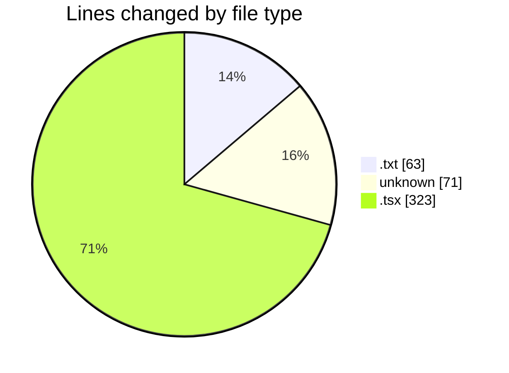
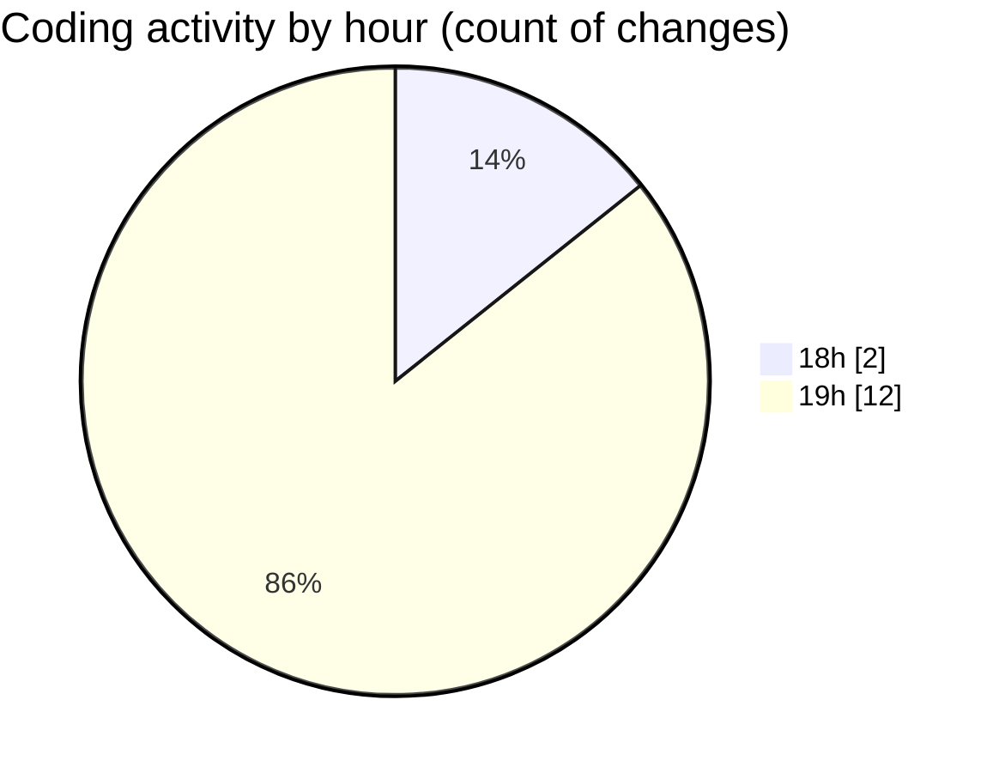

# ecodeli-1 - Activity Summary 

## Overall Statistics

| Stat                   | Value                                                             |
| ---------------------- | ----------------------------------------------------------------- |
| **Lines Added** (➕)   | 426                                          |
| **Lines Removed** (➖) | 31                                        |
| **Net Change** (↕)    | 395                |
| **Active Time** (⌚)   | 9 minutes |

## Modified Files
- **TODO.txt** (+43, -20)
- **.gitignore** (+71, -0)
- **page.tsx** (+33, -0)
- **deliverer-tutorial.tsx** (+142, -11)
- **page.tsx** (+53, -0)
- **page.tsx** (+84, -0)

## Visualizations

### By File Type (Lines Changed)

### By Hour (Estimated Activity Count)

> **Last Updated:** 5/22/2025, 7:31:37 PM