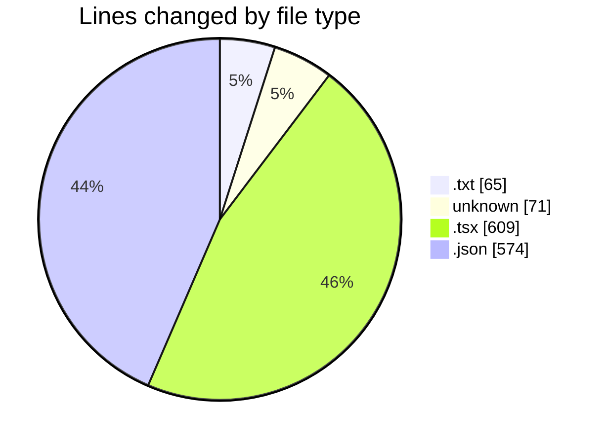
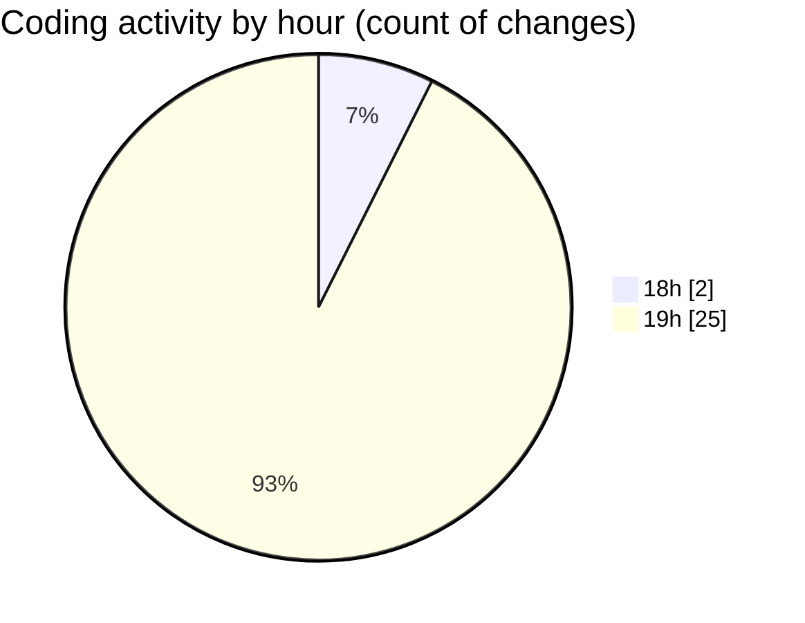

# ecodeli-1 - Activity Summary 

## Overall Statistics

| Stat                   | Value                                                             |
| ---------------------- | ----------------------------------------------------------------- |
| **Lines Added** (➕)   | 1121                                          |
| **Lines Removed** (➖) | 198                                        |
| **Net Change** (↕)    | 923                |
| **Active Time** (⌚)   | 31 minutes |

## Modified Files
- **TODO.txt** (+44, -21)
- **.gitignore** (+71, -0)
- **page.tsx** (+33, -0)
- **deliverer-tutorial.tsx** (+303, -26)
- **page.tsx** (+108, -0)
- **page.tsx** (+85, -0)
- **page.tsx** (+54, -0)
- **package.json** (+1, -0)
- **package.json** (+422, -151)

## Visualizations

### By File Type (Lines Changed)

### By Hour (Estimated Activity Count)

> **Last Updated:** 5/22/2025, 7:48:43 PM