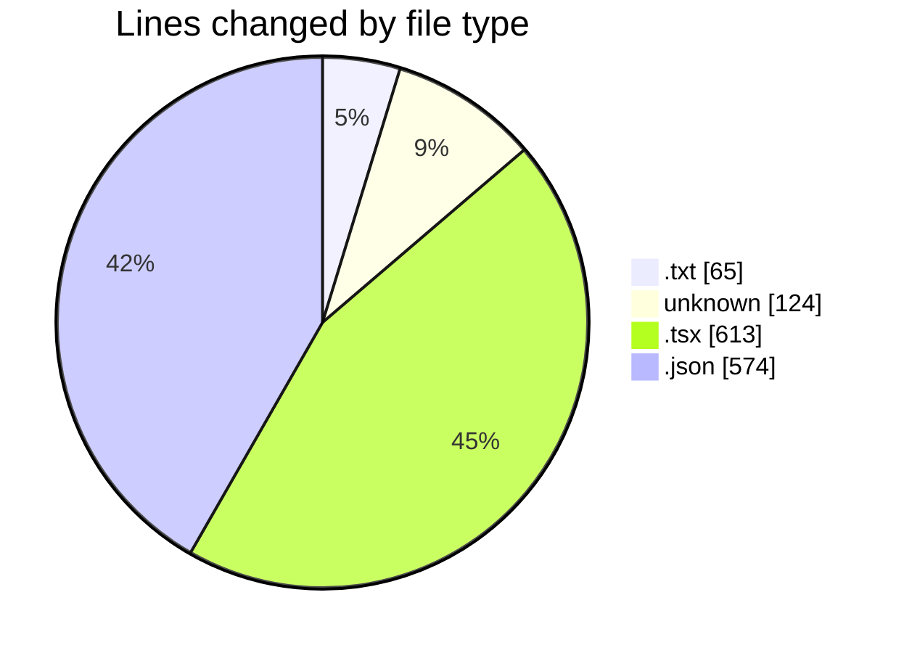
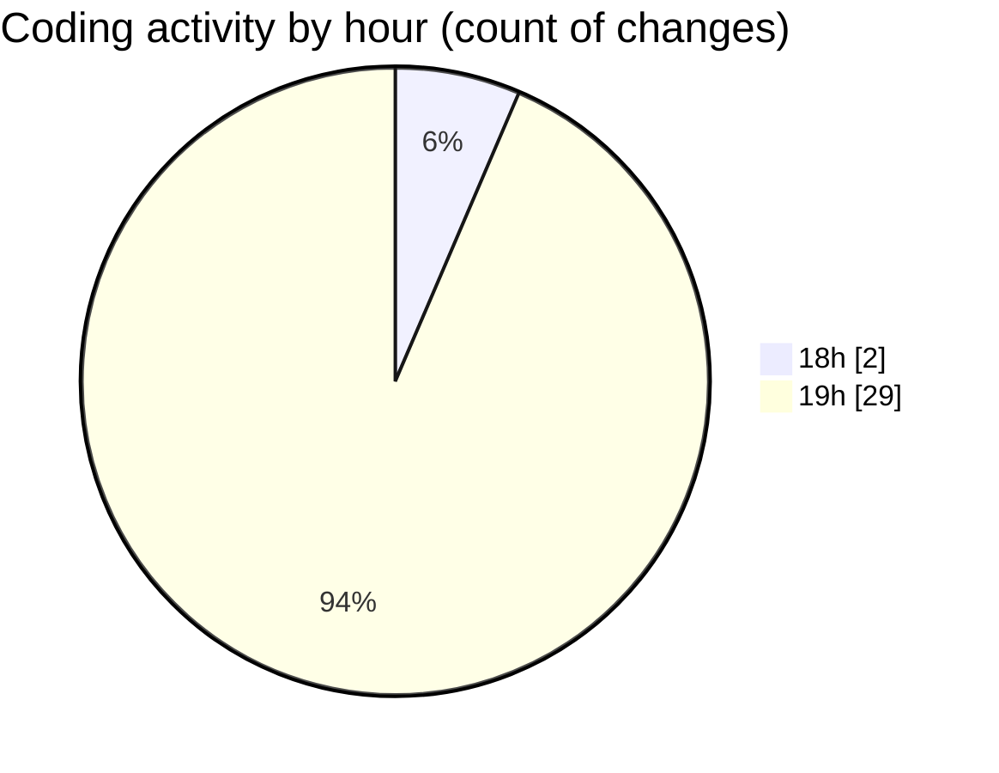

# ecodeli-1 - Activity Summary 

## Overall Statistics

| Stat                   | Value                                                             |
| ---------------------- | ----------------------------------------------------------------- |
| **Lines Added** (➕)   | 1174                                          |
| **Lines Removed** (➖) | 202                                        |
| **Net Change** (↕)    | 972                |
| **Active Time** (⌚)   | 41 minutes |

## Modified Files
- **TODO.txt** (+44, -21)
- **.gitignore** (+122, -0)
- **page.tsx** (+33, -0)
- **deliverer-tutorial.tsx** (+303, -30)
- **page.tsx** (+108, -0)
- **page.tsx** (+85, -0)
- **page.tsx** (+54, -0)
- **package.json** (+1, -0)
- **package.json** (+422, -151)
- **COMMIT_EDITMSG** (+2, -0)

## Visualizations

### By File Type (Lines Changed)

### By Hour (Estimated Activity Count)

> **Last Updated:** 5/22/2025, 7:53:43 PM