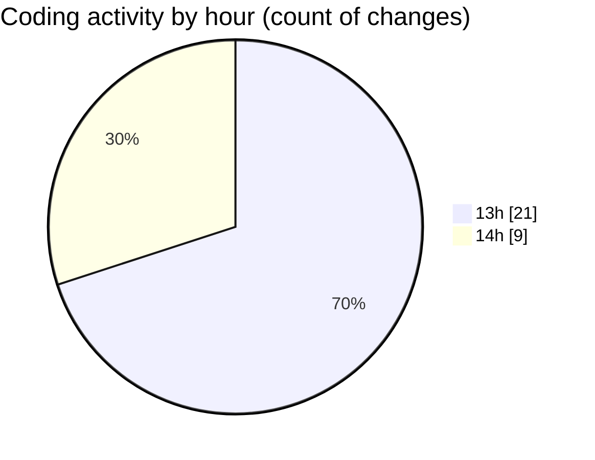

# ecodeli-1 - Activity Summary 

## Overall Statistics

| Stat                   | Value                                                             |
| ---------------------- | ----------------------------------------------------------------- |
| **Lines Added** (➕)   | 16261                                          |
| **Lines Removed** (➖) | 3128                                        |
| **Net Change** (↕)    | 13133                |
| **Active Time** (⌚)   | 33 minutes |

## Modified Files
- **en.json** (+4470, -0)
- **RecentActivitiesCard.tsx** (+204, -0)
- **fr.json** (+9318, -3128)
- **dashboard.ts** (+173, -0)
- **TODO.txt** (+31, -0)
- **TransactionStatsCard.tsx** (+181, -0)
- **dashboard.service.ts** (+1747, -0)
- **DeliveryStatsCard.tsx** (+137, -0)

## Visualizations

### By File Type (Lines Changed)

### By Hour (Estimated Activity Count)

> **Last Updated:** 5/26/2025, 2:17:31 PM