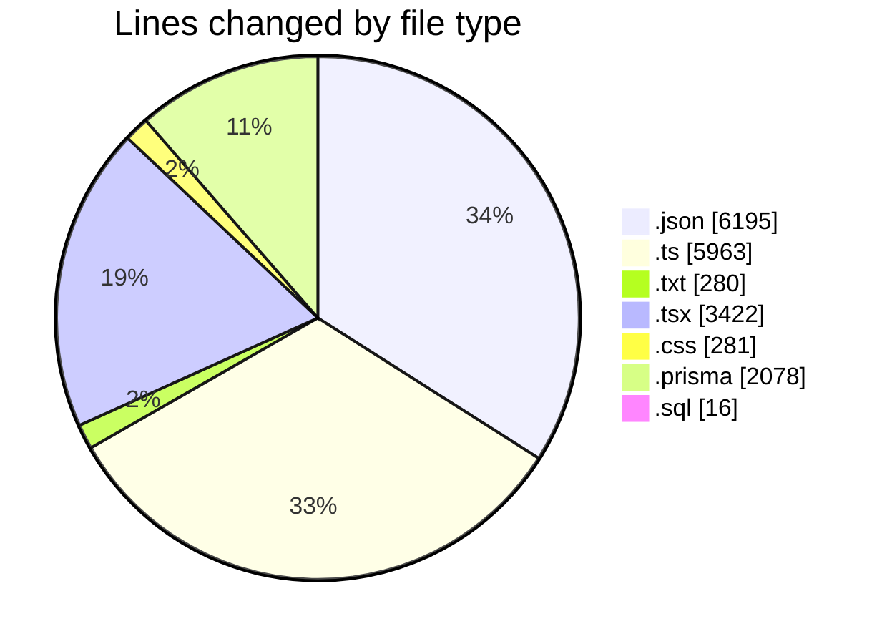
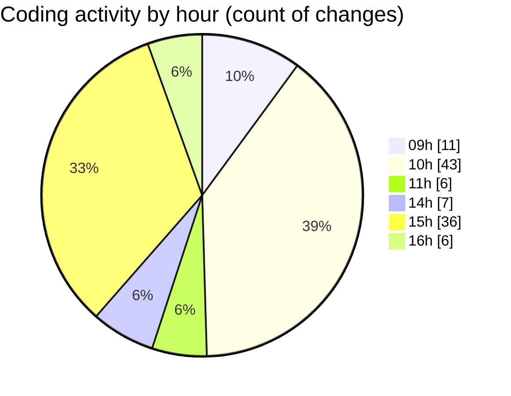

# ecodeli-1 - Activity Summary 

## Overall Statistics

| Stat                   | Value                                                             |
| ---------------------- | ----------------------------------------------------------------- |
| **Lines Added** (➕)   | 17367                                          |
| **Lines Removed** (➖) | 868                                        |
| **Net Change** (↕)    | 16499                |
| **Active Time** (⌚)   | 151 minutes |

## Modified Files
- **package.json** (+3, -2)
- **seed.ts** (+1206, -118)
- **TODO.txt** (+268, -12)
- **verification.router.ts** (+509, -46)
- **document.service.ts** (+1137, -8)
- **document-upload.tsx** (+477, -0)
- **auth.router.ts** (+842, -0)
- **verification.schema.ts** (+208, -0)
- **calendar.tsx** (+102, -34)
- **globals.css** (+236, -45)
- **document.router.ts** (+581, -0)
- **fr.json** (+6190, -0)
- **document-list.tsx** (+843, -414)
- **document-verification-list.tsx** (+552, -0)
- **pending-user-verifications.tsx** (+218, -0)
- **user-document-verification.tsx** (+632, -102)
- **provider-verification-form.tsx** (+43, -5)
- **document-type-mapping.ts** (+52, -5)
- **verification.service.ts** (+835, -3)
- **route.ts** (+135, -44)
- **next.config.ts** (+60, -0)
- **route.ts** (+69, -0)
- **route.ts** (+75, -30)
- **documents.prisma** (+33, -0)
- **migration_add_userRole_to_document.sql** (+8, -0)
- **migration.sql** (+8, -0)
- **schema.prisma** (+2045, -0)

## Visualizations

### By File Type (Lines Changed)

### By Hour (Estimated Activity Count)

> **Last Updated:** 5/27/2025, 4:06:14 PM