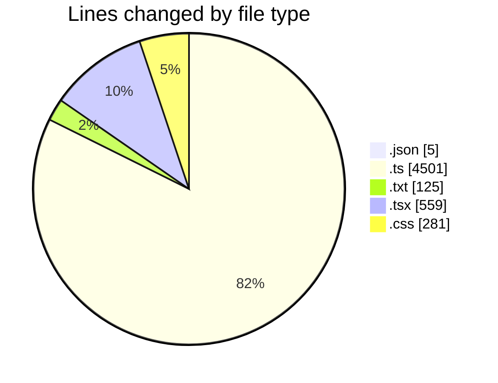
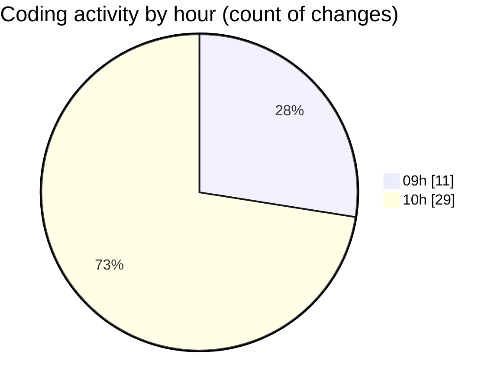

# ecodeli-1 - Activity Summary 

## Overall Statistics

| Stat                   | Value                                                             |
| ---------------------- | ----------------------------------------------------------------- |
| **Lines Added** (➕)   | 5226                                          |
| **Lines Removed** (➖) | 245                                        |
| **Net Change** (↕)    | 4981                |
| **Active Time** (⌚)   | 57 minutes |

## Modified Files
- **package.json** (+3, -2)
- **seed.ts** (+1169, -118)
- **TODO.txt** (+125, -0)
- **verification.router.ts** (+453, -46)
- **document.service.ts** (+1130, -0)
- **document-upload.tsx** (+423, -0)
- **auth.router.ts** (+796, -0)
- **verification.schema.ts** (+208, -0)
- **calendar.tsx** (+102, -34)
- **globals.css** (+236, -45)
- **document.router.ts** (+581, -0)

## Visualizations

### By File Type (Lines Changed)

### By Hour (Estimated Activity Count)

> **Last Updated:** 5/27/2025, 10:36:03 AM