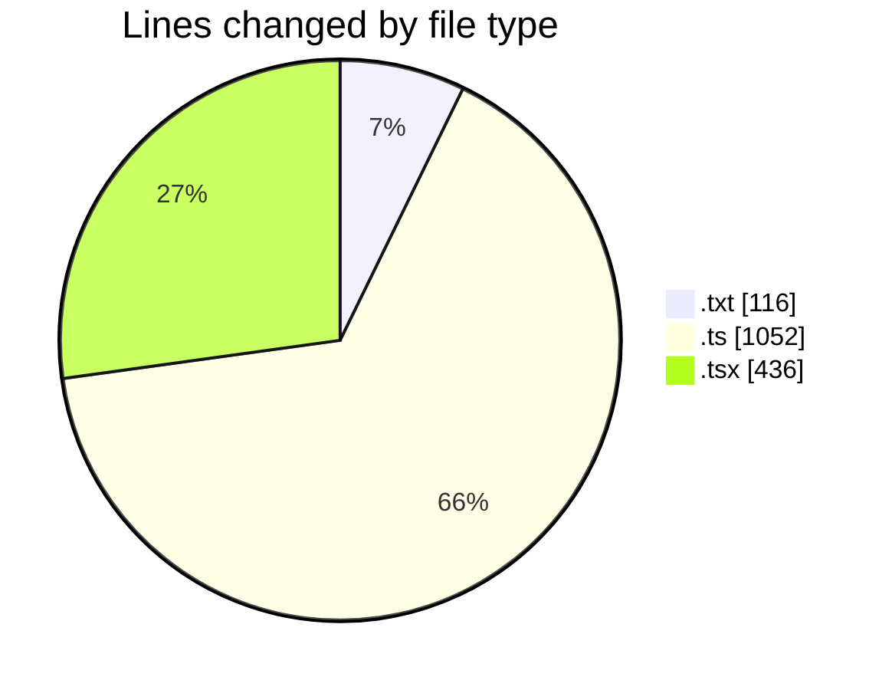
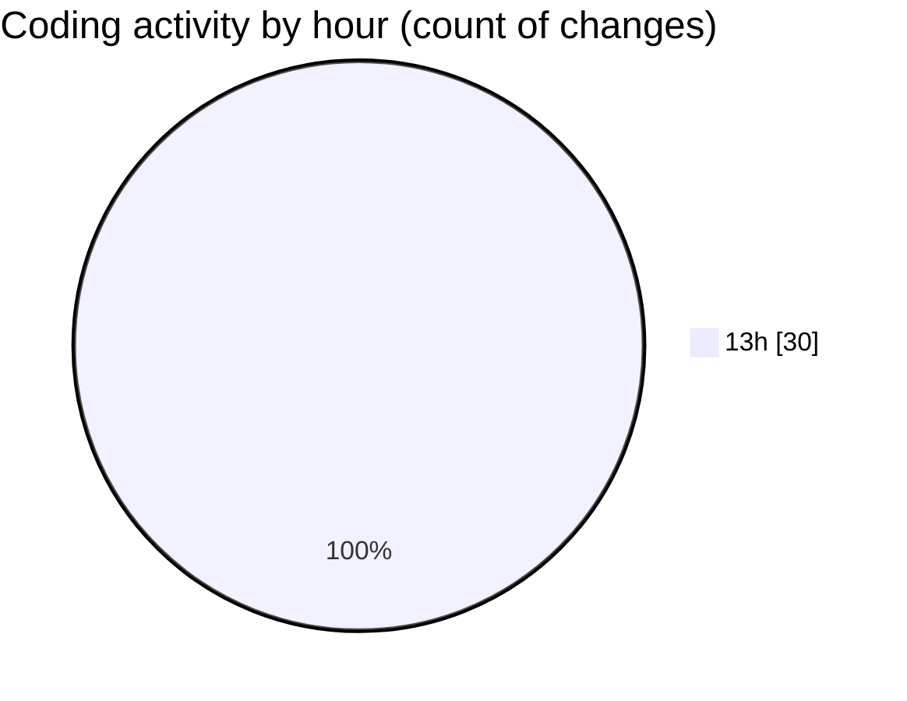

# ecodeli-1 - Activity Summary 

## Overall Statistics

| Stat                   | Value                                                             |
| ---------------------- | ----------------------------------------------------------------- |
| **Lines Added** (➕)   | 1536                                          |
| **Lines Removed** (➖) | 68                                        |
| **Net Change** (↕)    | 1468                |
| **Active Time** (⌚)   | 39 minutes |

## Modified Files
- **TODO.txt** (+81, -35)
- **document.router.ts** (+117, -0)
- **route.ts** (+148, -0)
- **route.ts** (+163, -0)
- **route.ts** (+41, -0)
- **route.ts** (+93, -0)
- **document.service.ts** (+0, -21)
- **trpc.ts** (+302, -0)
- **use-verification.ts** (+155, -12)
- **document-list.tsx** (+10, -0)
- **user-documents.tsx** (+426, -0)

## Visualizations

### By File Type (Lines Changed)

### By Hour (Estimated Activity Count)

> **Last Updated:** 5/28/2025, 1:55:13 PM