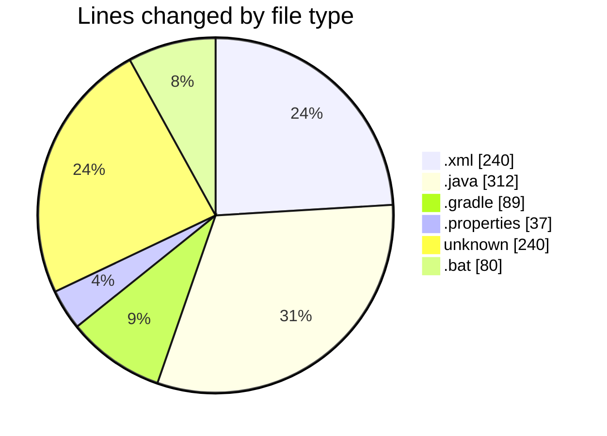
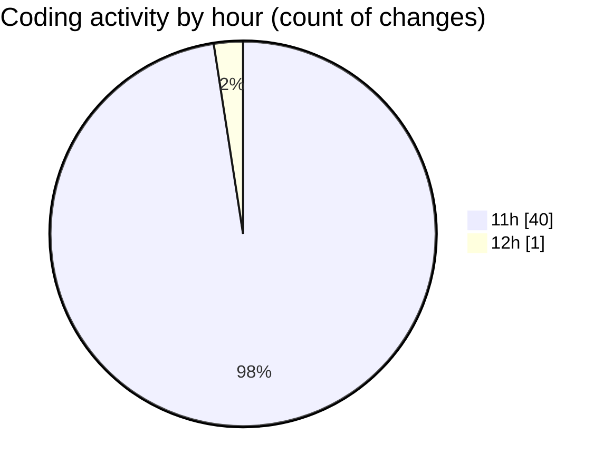

# archery_sum - Activity Summary 

## Overall Statistics

| Stat                   | Value                                                             |
| ---------------------- | ----------------------------------------------------------------- |
| **Lines Added** (➕)   | 993                                          |
| **Lines Removed** (➖) | 5                                        |
| **Net Change** (↕)    | 988                |
| **Active Time** (⌚)   | 43 minutes |

## Modified Files
- **AndroidManifest.xml** (+25, -0)
- **activity_main.xml** (+88, -0)
- **activity_history.xml** (+42, -0)
- **item_history.xml** (+47, -0)
- **strings.xml** (+12, -0)
- **colors.xml** (+10, -0)
- **themes.xml** (+16, -0)
- **MainActivity.java** (+145, -0)
- **HistoryActivity.java** (+101, -0)
- **HistoryAdapter.java** (+66, -0)
- **build.gradle** (+26, -0)
- **build.gradle** (+47, -0)
- **settings.gradle** (+16, -0)
- **gradle.properties** (+20, -0)
- **gradle-wrapper.properties** (+5, -0)
- **gradlew** (+240, -0)
- **gradlew.bat** (+80, -0)
- **local.properties** (+7, -5)

## Visualizations

### By File Type (Lines Changed)

### By Hour (Estimated Activity Count)

> **Last Updated:** 5/30/2025, 12:27:30 PM