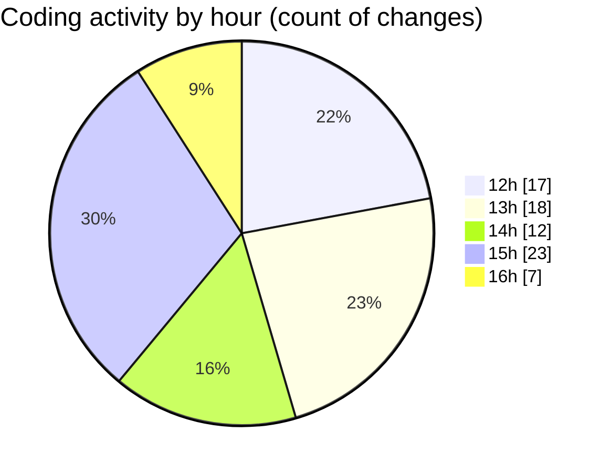

# video_app - Activity Summary 

## Overall Statistics

| Stat                   | Value                                                             |
| ---------------------- | ----------------------------------------------------------------- |
| **Lines Added** (➕)   | 5981                                          |
| **Lines Removed** (➖) | 507                                        |
| **Net Change** (↕)    | 5474                |
| **Active Time** (⌚)   | 123 minutes |

## Modified Files
- **main.py** (+150, -2)
- **capture_page.py** (+3396, -445)
- **viewer_page.py** (+1422, -0)
- **video_capture.py** (+646, -60)
- **video_saver.py** (+87, -0)
- **requirements.txt** (+4, -0)
- **frame_buffer.py** (+83, -0)
- **main.py** (+153, -0)
- **app.py** (+1, -0)
- **config.py** (+39, -0)

## Visualizations

### By File Type (Lines Changed)

### By Hour (Estimated Activity Count)

> **Last Updated:** 6/1/2025, 4:09:20 PM