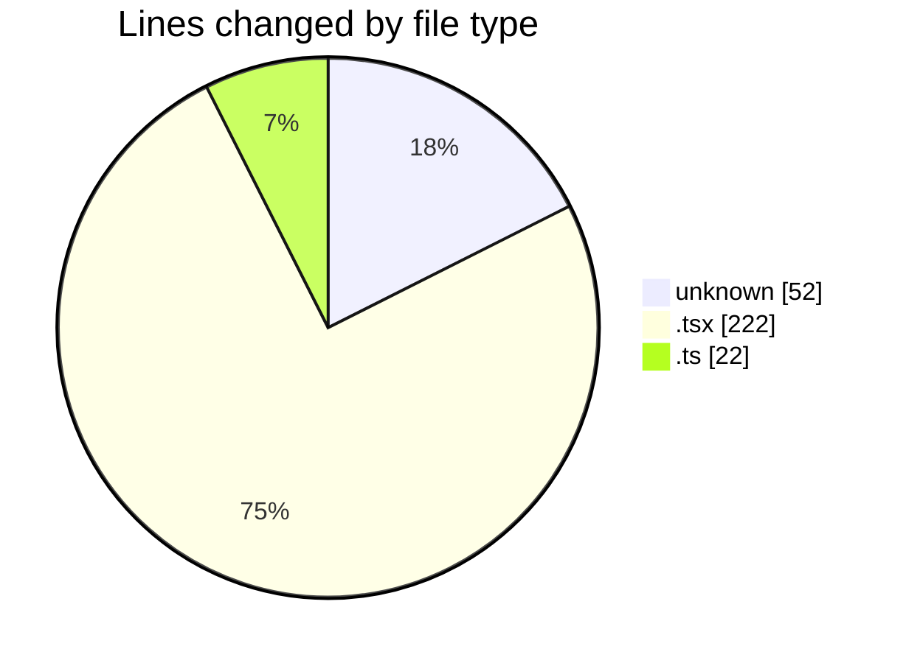
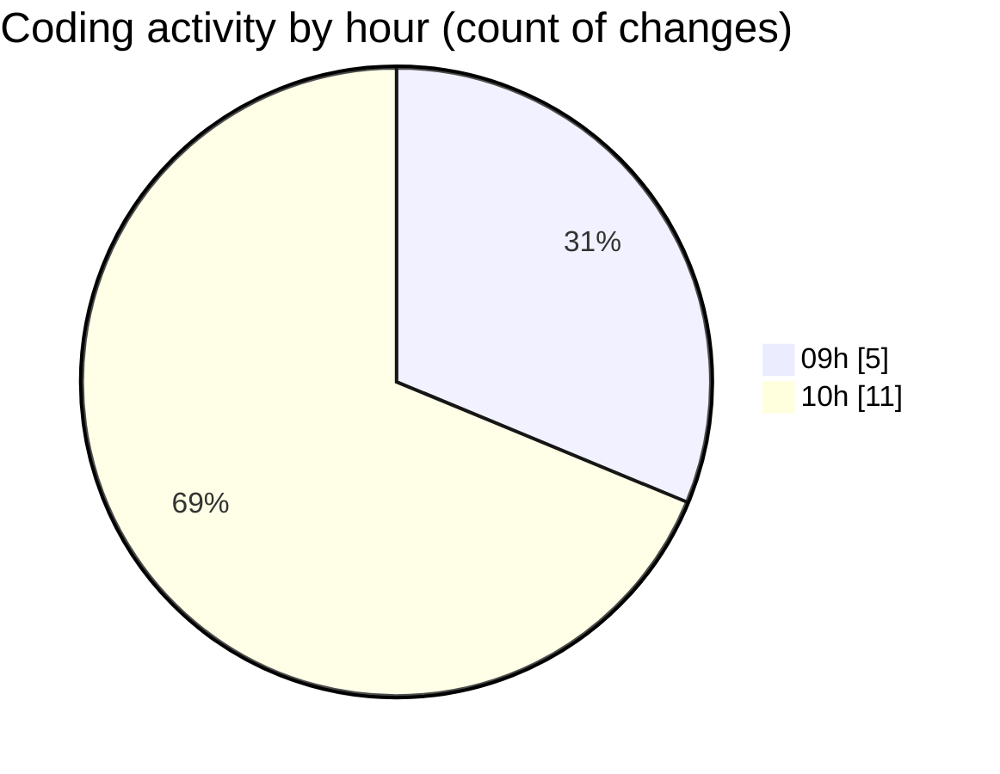

# ecodeli-1 - Activity Summary 

## Overall Statistics

| Stat                   | Value                                                             |
| ---------------------- | ----------------------------------------------------------------- |
| **Lines Added** (➕)   | 296                                          |
| **Lines Removed** (➖) | 0                                        |
| **Net Change** (↕)    | 296                |
| **Active Time** (⌚)   | 17 minutes |

## Modified Files
- **.gitignore** (+52, -0)
- **page.tsx** (+55, -0)
- **page.tsx** (+86, -0)
- **app-providers.tsx** (+18, -0)
- **dashboard.ts** (+22, -0)
- **chat-interface.tsx** (+7, -0)
- **conversation-list.tsx** (+3, -0)
- **message-bubble.tsx** (+10, -0)
- **message-input.tsx** (+7, -0)
- **activity-report.tsx** (+18, -0)
- **delivery-statistics.tsx** (+18, -0)

## Visualizations

### By File Type (Lines Changed)

### By Hour (Estimated Activity Count)

> **Last Updated:** 6/2/2025, 10:27:27 AM