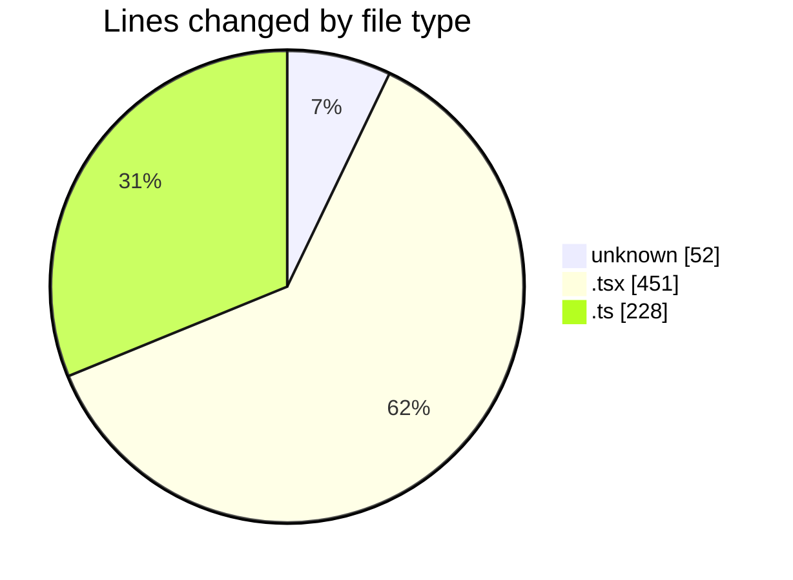
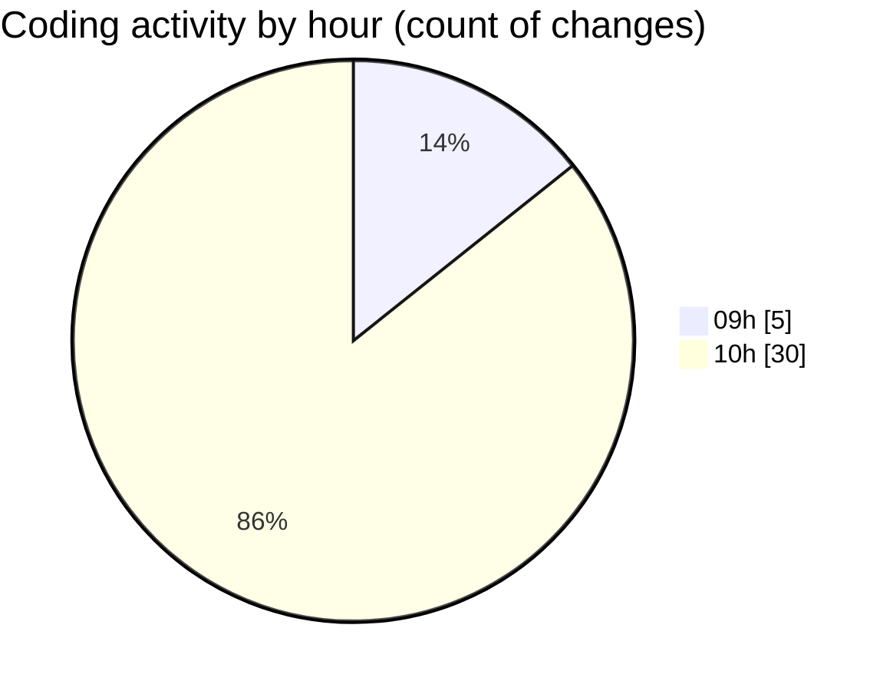

# ecodeli-1 - Activity Summary 

## Overall Statistics

| Stat                   | Value                                                             |
| ---------------------- | ----------------------------------------------------------------- |
| **Lines Added** (➕)   | 731                                          |
| **Lines Removed** (➖) | 0                                        |
| **Net Change** (↕)    | 731                |
| **Active Time** (⌚)   | 37 minutes |

## Modified Files
- **.gitignore** (+52, -0)
- **page.tsx** (+55, -0)
- **page.tsx** (+86, -0)
- **app-providers.tsx** (+18, -0)
- **dashboard.ts** (+22, -0)
- **chat-interface.tsx** (+7, -0)
- **conversation-list.tsx** (+3, -0)
- **message-bubble.tsx** (+10, -0)
- **message-input.tsx** (+7, -0)
- **activity-report.tsx** (+18, -0)
- **delivery-statistics.tsx** (+18, -0)
- **site.ts** (+10, -0)
- **api.ts** (+9, -0)
- **routes.ts** (+10, -0)
- **language-context.tsx** (+51, -0)
- **theme-context.tsx** (+43, -0)
- **notification-context.tsx** (+64, -0)
- **enums.ts** (+51, -0)
- **permissions.ts** (+65, -0)
- **export-report.tsx** (+13, -0)
- **user-statistics.tsx** (+14, -0)
- **password-reset-email.tsx** (+22, -0)
- **verification-email.tsx** (+22, -0)
- **use-messaging.ts** (+61, -0)

## Visualizations

### By File Type (Lines Changed)

### By Hour (Estimated Activity Count)

> **Last Updated:** 6/2/2025, 10:37:27 AM