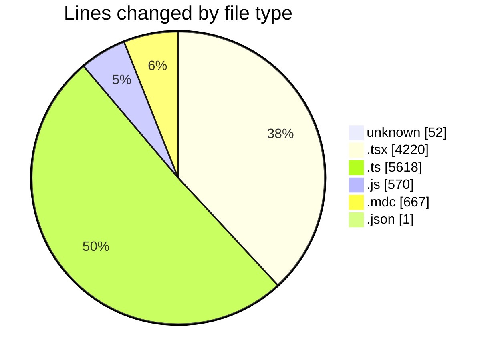
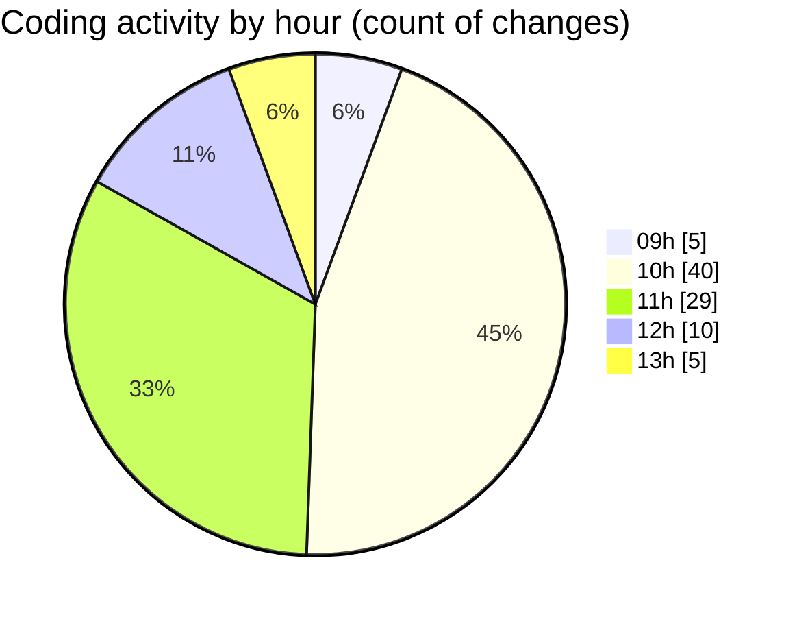

# ecodeli-1 - Activity Summary 

## Overall Statistics

| Stat                   | Value                                                             |
| ---------------------- | ----------------------------------------------------------------- |
| **Lines Added** (➕)   | 10553                                          |
| **Lines Removed** (➖) | 575                                        |
| **Net Change** (↕)    | 9978                |
| **Active Time** (⌚)   | 124 minutes |

## Modified Files
- **.gitignore** (+52, -0)
- **page.tsx** (+55, -0)
- **page.tsx** (+86, -0)
- **app-providers.tsx** (+18, -0)
- **dashboard.ts** (+22, -0)
- **chat-interface.tsx** (+7, -0)
- **conversation-list.tsx** (+3, -0)
- **message-bubble.tsx** (+10, -0)
- **message-input.tsx** (+7, -0)
- **activity-report.tsx** (+18, -0)
- **delivery-statistics.tsx** (+18, -0)
- **site.ts** (+10, -0)
- **api.ts** (+9, -0)
- **routes.ts** (+10, -0)
- **language-context.tsx** (+51, -0)
- **theme-context.tsx** (+43, -0)
- **notification-context.tsx** (+64, -0)
- **enums.ts** (+51, -0)
- **permissions.ts** (+65, -0)
- **export-report.tsx** (+13, -0)
- **user-statistics.tsx** (+14, -0)
- **password-reset-email.tsx** (+22, -0)
- **verification-email.tsx** (+22, -0)
- **use-messaging.ts** (+61, -0)
- **verification.service.ts** (+833, -0)
- **user-document-verification.tsx** (+1093, -564)
- **profile-documents-list.tsx** (+221, -0)
- **document.service.ts** (+1150, -0)
- **document-verification.tsx** (+348, -0)
- **seed.ts** (+1088, -0)
- **verification-seed.ts** (+521, -0)
- **test-provider-verification.js** (+239, -0)
- **document-upload.tsx** (+478, -0)
- **test-provider-documents.js** (+77, -0)
- **check-provider-status.js** (+71, -0)
- **check-user-verification.js** (+75, -0)
- **fix-provider-documents.ts** (+75, -0)
- **trigger-verification.js** (+108, -0)
- **trigger-provider-verification.ts** (+67, -0)
- **test-automatic-verification.ts** (+97, -0)
- **document.router.ts** (+1412, -2)
- **use-documents.ts** (+145, -0)
- **document-list.tsx** (+439, -0)
- **document-verification-list.tsx** (+574, -4)
- **architecturerules.mdc** (+265, -0)
- **ecodeli.mdc** (+40, -0)
- **windows.mdc** (+362, -0)
- **merchant-verification-form.tsx** (+43, -5)
- **package.json** (+1, -0)

## Visualizations

### By File Type (Lines Changed)

### By Hour (Estimated Activity Count)

> **Last Updated:** 6/2/2025, 1:43:43 PM