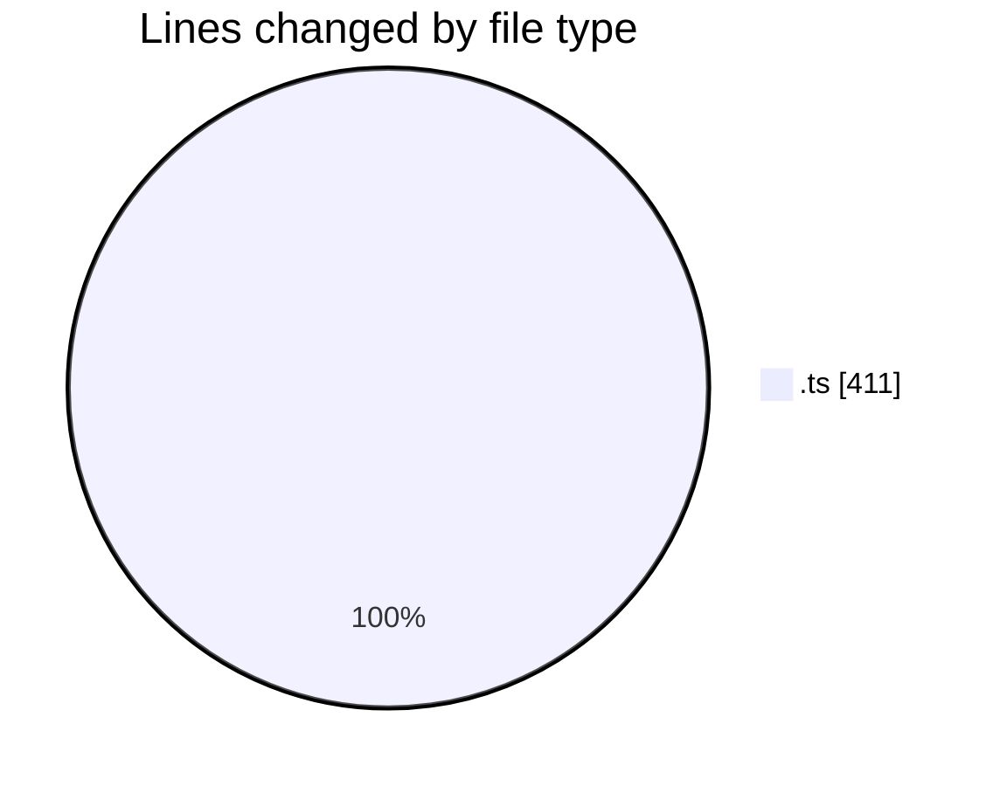
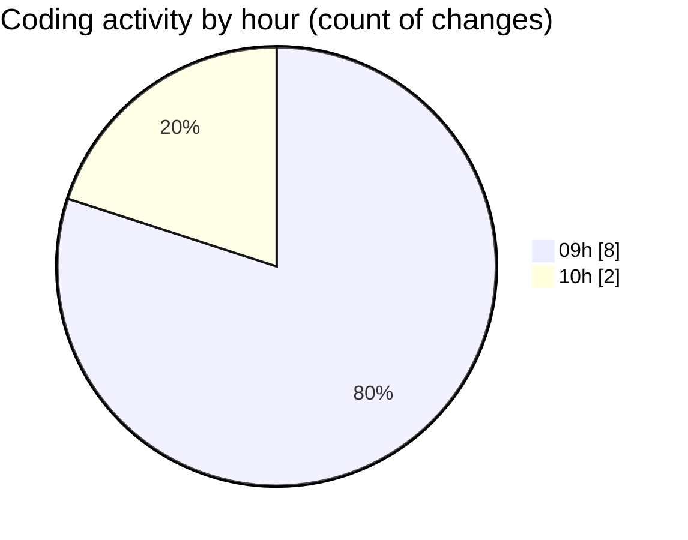

# ecodeli-1 - Activity Summary 

## Overall Statistics

| Stat                   | Value                                                             |
| ---------------------- | ----------------------------------------------------------------- |
| **Lines Added** (➕)   | 396                                          |
| **Lines Removed** (➖) | 15                                        |
| **Net Change** (↕)    | 381                |
| **Active Time** (⌚)   | 18 minutes |

## Modified Files
- **document-verification.ts** (+127, -0)
- **document-verification.service.ts** (+245, -0)
- **document.service.ts** (+0, -15)
- **document.router.ts** (+21, -0)
- **use-document-verification.ts** (+1, -0)
- **error-handler.ts** (+1, -0)
- **use-user-document-status.ts** (+1, -0)

## Visualizations

### By File Type (Lines Changed)

### By Hour (Estimated Activity Count)

> **Last Updated:** 6/3/2025, 10:03:42 AM