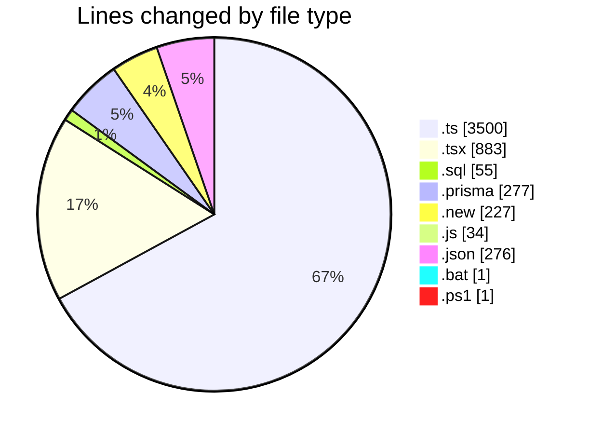
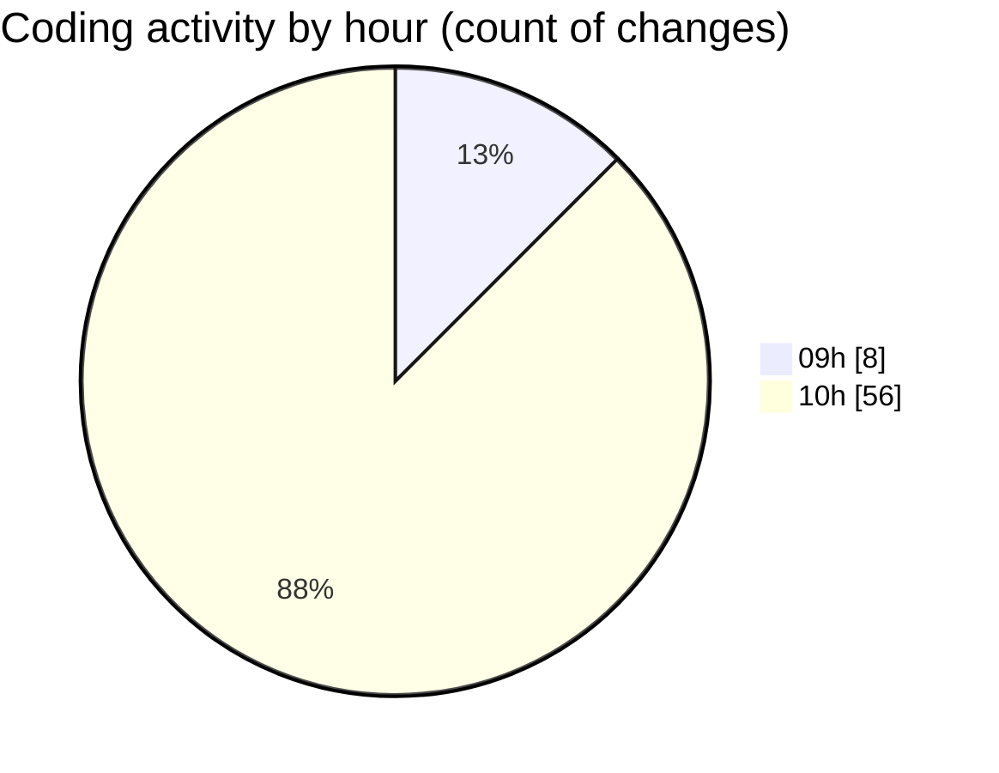

# ecodeli-1 - Activity Summary 

## Overall Statistics

| Stat                   | Value                                                             |
| ---------------------- | ----------------------------------------------------------------- |
| **Lines Added** (➕)   | 4995                                          |
| **Lines Removed** (➖) | 259                                        |
| **Net Change** (↕)    | 4736                |
| **Active Time** (⌚)   | 92 minutes |

## Modified Files
- **document-verification.ts** (+127, -0)
- **document-verification.service.ts** (+245, -0)
- **document.service.ts** (+1, -35)
- **document.router.ts** (+21, -0)
- **use-document-verification.ts** (+137, -0)
- **error-handler.ts** (+114, -0)
- **use-user-document-status.ts** (+79, -0)
- **document.service.updated.ts** (+845, -0)
- **document-verification.test.ts** (+244, -0)
- **migrate-document-data.ts** (+270, -0)
- **document-verification-panel.tsx** (+391, -0)
- **admin-document-verification.tsx** (+492, -0)
- **document-status-machine.ts** (+449, -224)
- **migration.sql** (+55, -0)
- **apply-migration.ts** (+241, -0)
- **document-transitions.prisma** (+25, -0)
- **documents.prisma** (+39, -0)
- **verifications.prisma** (+105, -0)
- **user.prisma** (+108, -0)
- **migrate-document-status-system.ts** (+64, -0)
- **migrate-existing-documents.ts** (+257, -0)
- **document-status-machine.ts.new** (+227, -0)
- **run-all-document-migrations.ts** (+147, -0)
- **run-document-migration.js** (+34, -0)
- **package.json** (+276, -0)
- **run-document-migration.bat** (+1, -0)
- **Run-DocumentMigration.ps1** (+1, -0)

## Visualizations

### By File Type (Lines Changed)

### By Hour (Estimated Activity Count)

> **Last Updated:** 6/3/2025, 10:53:42 AM