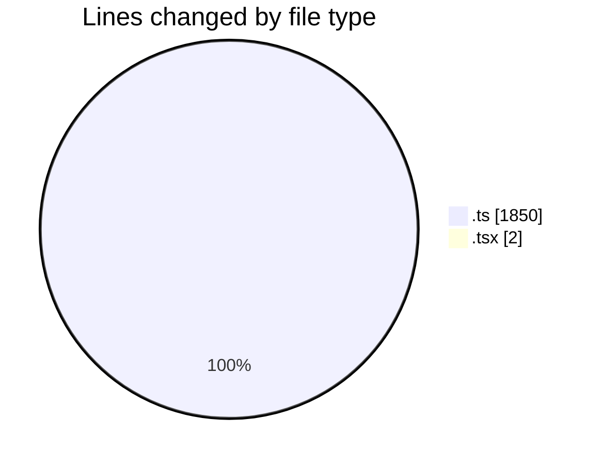
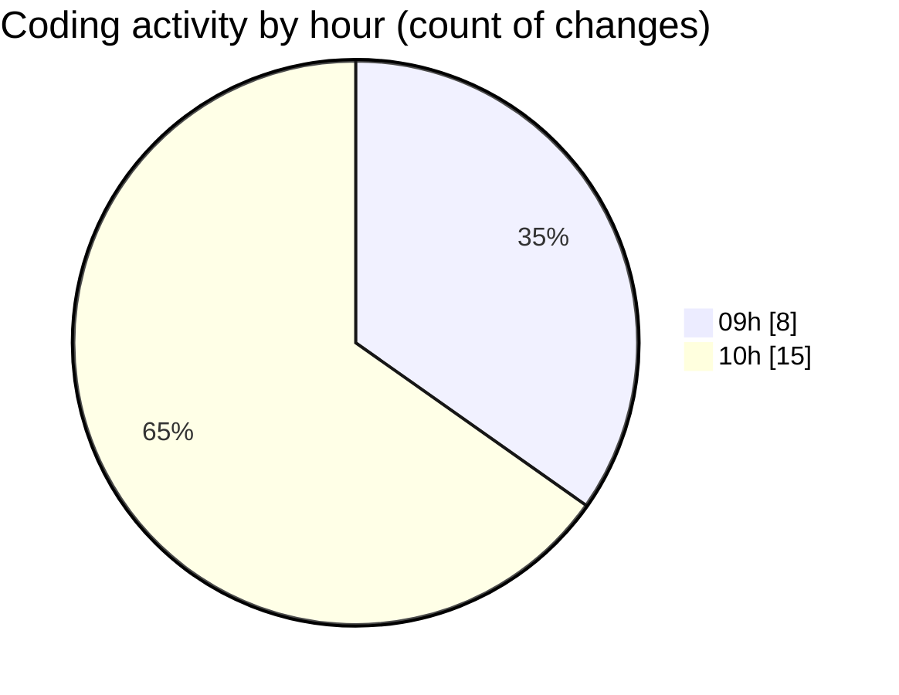

# ecodeli-1 - Activity Summary 

## Overall Statistics

| Stat                   | Value                                                             |
| ---------------------- | ----------------------------------------------------------------- |
| **Lines Added** (➕)   | 1817                                          |
| **Lines Removed** (➖) | 35                                        |
| **Net Change** (↕)    | 1782                |
| **Active Time** (⌚)   | 30 minutes |

## Modified Files
- **document-verification.ts** (+127, -0)
- **document-verification.service.ts** (+245, -0)
- **document.service.ts** (+1, -35)
- **document.router.ts** (+21, -0)
- **use-document-verification.ts** (+137, -0)
- **error-handler.ts** (+114, -0)
- **use-user-document-status.ts** (+79, -0)
- **document.service.updated.ts** (+845, -0)
- **document-verification.test.ts** (+244, -0)
- **migrate-document-data.ts** (+1, -0)
- **document-verification-panel.tsx** (+1, -0)
- **admin-document-verification.tsx** (+1, -0)
- **document-status-machine.ts** (+1, -0)

## Visualizations

### By File Type (Lines Changed)

### By Hour (Estimated Activity Count)

> **Last Updated:** 6/3/2025, 10:28:42 AM