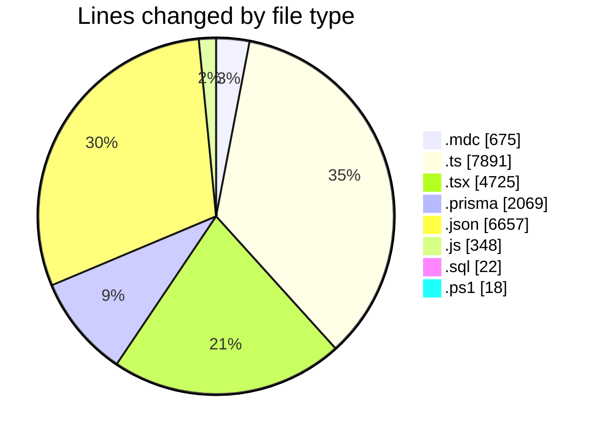
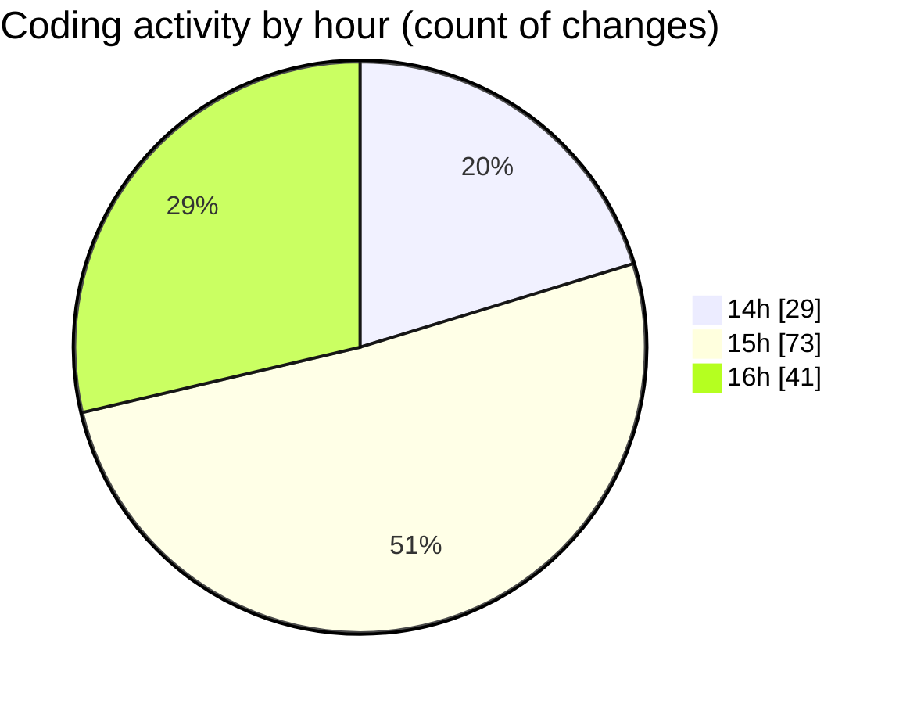

# ecodeli-1 - Activity Summary 

## Overall Statistics

| Stat                   | Value                                                             |
| ---------------------- | ----------------------------------------------------------------- |
| **Lines Added** (➕)   | 21278                                          |
| **Lines Removed** (➖) | 1127                                        |
| **Net Change** (↕)    | 20151                |
| **Active Time** (⌚)   | 204 minutes |

## Modified Files
- **architecturerules.mdc** (+265, -0)
- **ecodeli.mdc** (+40, -0)
- **windows.mdc** (+370, -0)
- **document-utils.ts** (+167, -0)
- **document.service.ts** (+1266, -16)
- **document-verification.service.ts** (+250, -0)
- **document-validation.ts** (+241, -2)
- **document-fix.router.ts** (+251, -0)
- **root.ts** (+80, -0)
- **document-validation-checker.tsx** (+395, -0)
- **page.tsx** (+60, -1)
- **document-utils.ts** (+98, -0)
- **schema.prisma** (+2057, -12)
- **document-type-mapping.ts** (+142, -0)
- **fr.json** (+6608, -49)
- **document-upload.tsx** (+474, -3)
- **test-document-names.js** (+16, -0)
- **auth.router.ts** (+814, -5)
- **test-document-mapping.js** (+46, -0)
- **test-document-detection.js** (+67, -0)
- **fix-existing-documents.sql** (+22, -0)
- **fix-documents.js** (+69, -0)
- **verification.service.ts** (+1333, -61)
- **layout.tsx** (+35, -0)
- **layout.tsx** (+41, -2)
- **layout.tsx** (+34, -3)
- **admin-user.router.ts** (+683, -6)
- **merchant-verification-form.tsx** (+39, -1)
- **user-document-verification.tsx** (+1047, -549)
- **page.tsx** (+117, -1)
- **page.tsx** (+116, -0)
- **test-verification.js** (+39, -0)
- **fix-document-userrole.js** (+60, -0)
- **utils.ts** (+126, -0)
- **test-user.js** (+51, -0)
- **use-messaging-store.ts** (+30, -0)
- **use-document-store.ts** (+21, -0)
- **dashboard.service.ts** (+1804, -0)
- **page.tsx** (+185, -1)
- **test-page.ps1** (+9, -0)
- **deliverers-table.tsx** (+488, -0)
- **deliverers-stats.tsx** (+232, -0)
- **deliverer-admin.service.ts** (+382, -113)
- **page.tsx** (+599, -302)
- **test-deliverers.ps1** (+9, -0)

## Visualizations

### By File Type (Lines Changed)

### By Hour (Estimated Activity Count)

> **Last Updated:** 6/5/2025, 4:44:14 PM