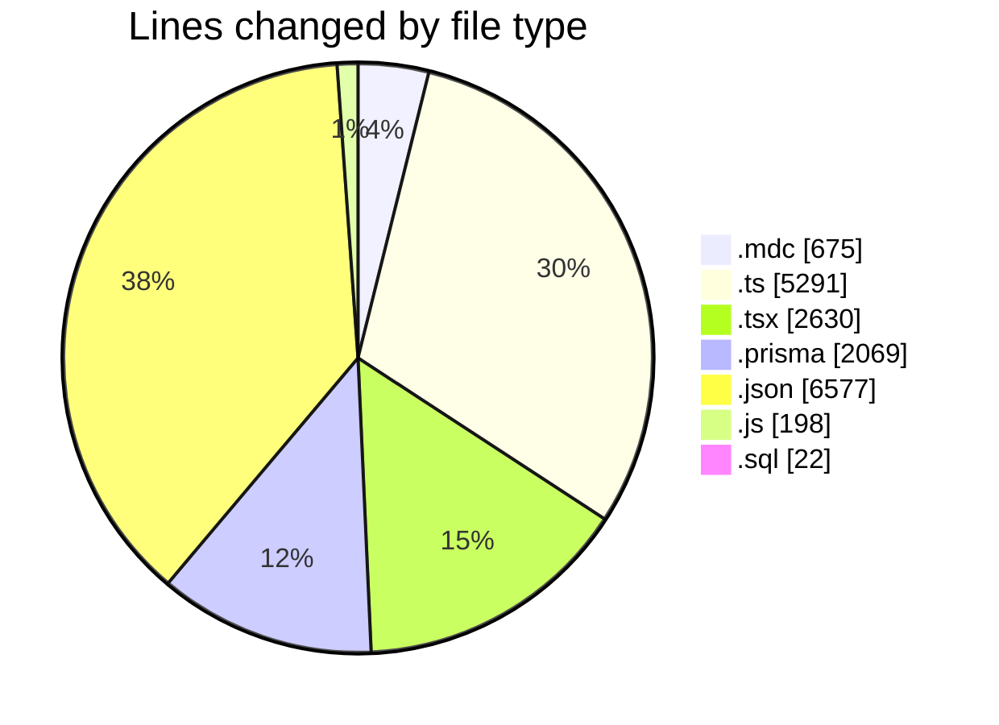
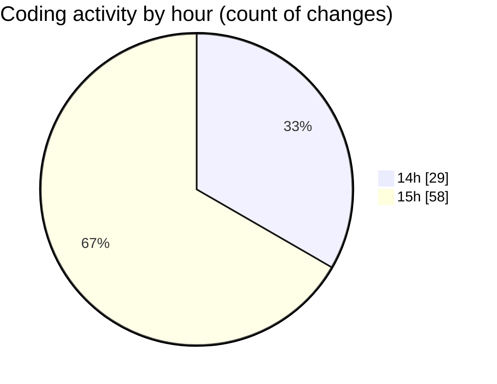

# ecodeli-1 - Activity Summary 

## Overall Statistics

| Stat                   | Value                                                             |
| ---------------------- | ----------------------------------------------------------------- |
| **Lines Added** (➕)   | 16916                                          |
| **Lines Removed** (➖) | 546                                        |
| **Net Change** (↕)    | 16370                |
| **Active Time** (⌚)   | 125 minutes |

## Modified Files
- **architecturerules.mdc** (+265, -0)
- **ecodeli.mdc** (+40, -0)
- **windows.mdc** (+370, -0)
- **document-utils.ts** (+167, -0)
- **document.service.ts** (+1266, -15)
- **document-verification.service.ts** (+250, -0)
- **document-validation.ts** (+241, -2)
- **document-fix.router.ts** (+251, -0)
- **root.ts** (+80, -0)
- **document-validation-checker.tsx** (+395, -0)
- **page.tsx** (+55, -1)
- **document-utils.ts** (+98, -0)
- **schema.prisma** (+2057, -12)
- **document-type-mapping.ts** (+142, -0)
- **fr.json** (+6577, -0)
- **document-upload.tsx** (+474, -3)
- **test-document-names.js** (+16, -0)
- **auth.router.ts** (+813, -0)
- **test-document-mapping.js** (+46, -0)
- **test-document-detection.js** (+67, -0)
- **fix-existing-documents.sql** (+22, -0)
- **fix-documents.js** (+69, -0)
- **verification.service.ts** (+1279, -4)
- **layout.tsx** (+35, -0)
- **layout.tsx** (+41, -2)
- **layout.tsx** (+32, -2)
- **admin-user.router.ts** (+683, -0)
- **merchant-verification-form.tsx** (+38, -1)
- **user-document-verification.tsx** (+1047, -504)

## Visualizations

### By File Type (Lines Changed)

### By Hour (Estimated Activity Count)

> **Last Updated:** 6/5/2025, 3:49:12 PM