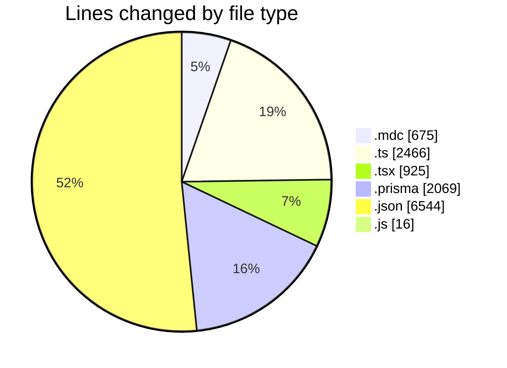
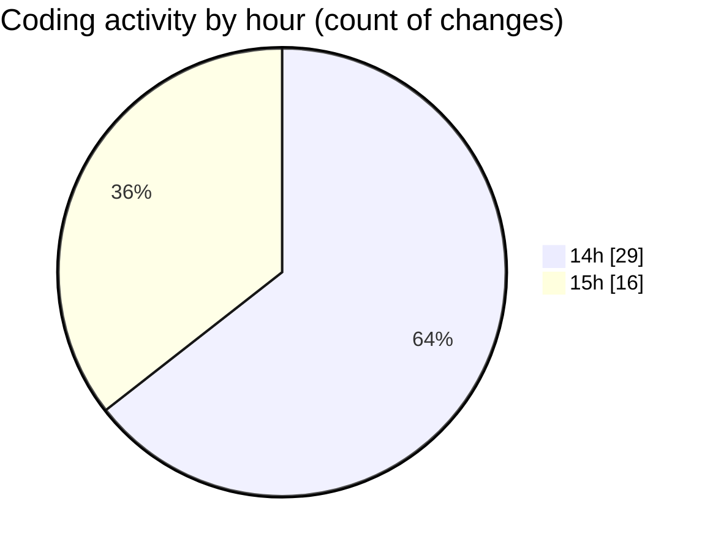

# ecodeli-1 - Activity Summary 

## Overall Statistics

| Stat                   | Value                                                             |
| ---------------------- | ----------------------------------------------------------------- |
| **Lines Added** (➕)   | 12680                                          |
| **Lines Removed** (➖) | 15                                        |
| **Net Change** (↕)    | 12665                |
| **Active Time** (⌚)   | 62 minutes |

## Modified Files
- **architecturerules.mdc** (+265, -0)
- **ecodeli.mdc** (+40, -0)
- **windows.mdc** (+370, -0)
- **document-utils.ts** (+167, -0)
- **document.service.ts** (+1251, -0)
- **document-verification.service.ts** (+250, -0)
- **document-validation.ts** (+225, -2)
- **document-fix.router.ts** (+251, -0)
- **root.ts** (+80, -0)
- **document-validation-checker.tsx** (+395, -0)
- **page.tsx** (+55, -1)
- **document-utils.ts** (+98, -0)
- **schema.prisma** (+2057, -12)
- **document-type-mapping.ts** (+142, -0)
- **fr.json** (+6544, -0)
- **document-upload.tsx** (+474, -0)
- **test-document-names.js** (+16, -0)

## Visualizations

### By File Type (Lines Changed)

### By Hour (Estimated Activity Count)

> **Last Updated:** 6/5/2025, 3:09:10 PM