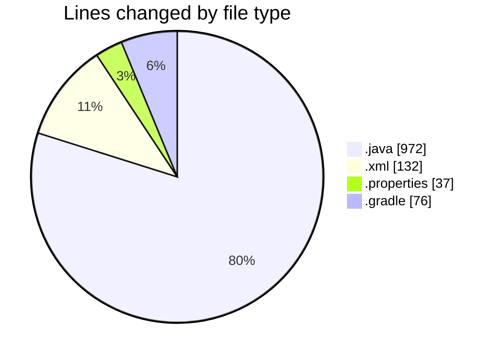
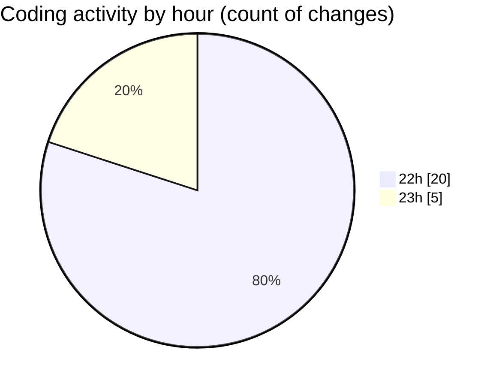

# AndroidSumApp - Activity Summary 

## Overall Statistics

| Stat                   | Value                                                             |
| ---------------------- | ----------------------------------------------------------------- |
| **Lines Added** (➕)   | 1212                                          |
| **Lines Removed** (➖) | 5                                        |
| **Net Change** (↕)    | 1207                |
| **Active Time** (⌚)   | 22 minutes |

## Modified Files
- **MainActivity.java** (+621, -4)
- **StatsActivity.java** (+346, -1)
- **activity_main.xml** (+132, -0)
- **gradle.properties** (+29, -0)
- **build.gradle** (+21, -0)
- **gradle-wrapper.properties** (+8, -0)
- **build.gradle** (+55, -0)

## Visualizations

### By File Type (Lines Changed)

### By Hour (Estimated Activity Count)

> **Last Updated:** 6/6/2025, 11:26:25 PM