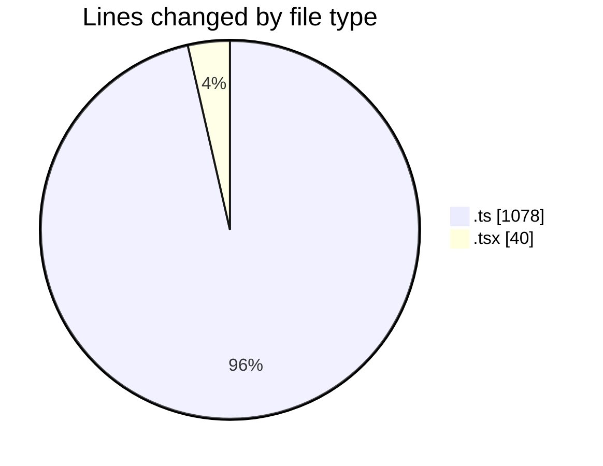

# ecodeli-1 - Activity Summary 

## Overall Statistics

| Stat                   | Value                                                             |
| ---------------------- | ----------------------------------------------------------------- |
| **Lines Added** (➕)   | 1083                                          |
| **Lines Removed** (➖) | 35                                        |
| **Net Change** (↕)    | 1048                |
| **Active Time** (⌚)   | 23 minutes |

## Modified Files
- **trpc.ts** (+335, -14)
- **layout.tsx** (+37, -3)
- **auth.ts** (+124, -4)
- **next-auth.ts** (+268, -0)
- **route.ts** (+47, -8)
- **admin-user.router.ts** (+12, -4)
- **user-management.schema.ts** (+258, -0)
- **admin.service.ts** (+2, -2)

## Visualizations

### By File Type (Lines Changed)

### By Hour (Estimated Activity Count)

> **Last Updated:** 6/6/2025, 9:59:09 AM