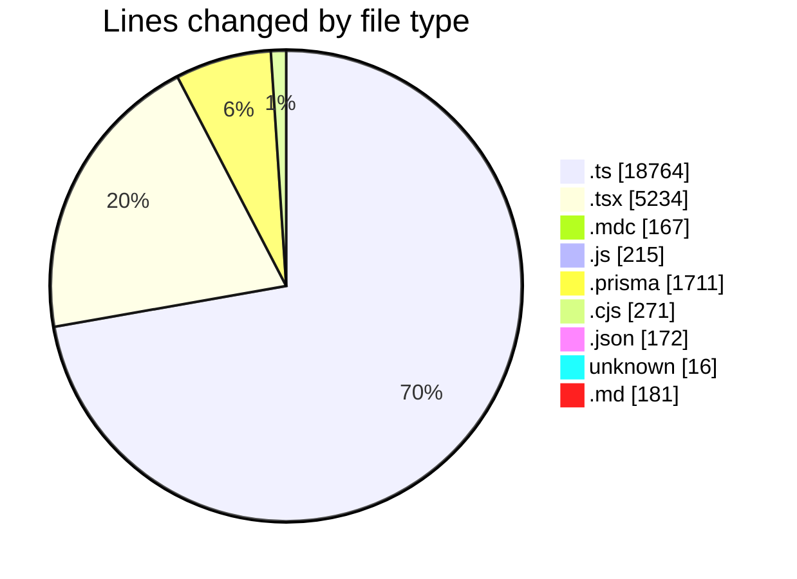
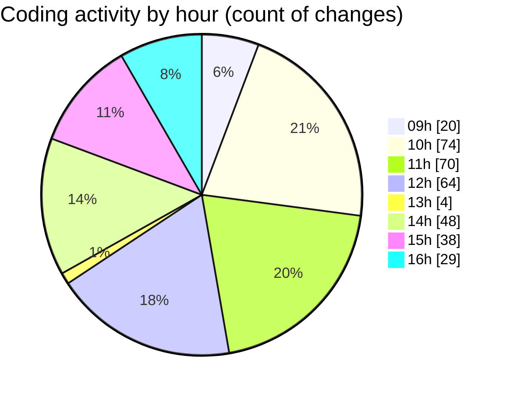

# ecodeli-1 - Activity Summary 

## Overall Statistics

| Stat                   | Value                                                             |
| ---------------------- | ----------------------------------------------------------------- |
| **Lines Added** (➕)   | 24178                                          |
| **Lines Removed** (➖) | 2553                                        |
| **Net Change** (↕)    | 21625                |
| **Active Time** (⌚)   | 499 minutes |

## Modified Files
- **trpc.ts** (+345, -14)
- **layout.tsx** (+37, -3)
- **auth.ts** (+124, -4)
- **next-auth.ts** (+268, -0)
- **route.ts** (+47, -8)
- **admin-user.router.ts** (+98, -131)
- **user-management.schema.ts** (+258, -0)
- **admin.service.ts** (+42, -2)
- **admin-dashboard.router.ts** (+217, -0)
- **delivery.router.ts** (+1172, -0)
- **delivery.service.ts** (+1878, -0)
- **root.ts** (+43, -4)
- **financial.router.ts** (+623, -0)
- **announcement.router.ts** (+1028, -0)
- **commission.service.ts** (+1035, -378)
- **windows.mdc** (+0, -2)
- **payment.service.ts** (+1257, -0)
- **maps.service.ts** (+55, -0)
- **messaging.service.ts** (+19, -0)
- **messaging.router.ts** (+33, -0)
- **test-admin-users.ts** (+52, -0)
- **test-trpc-client.ts** (+46, -0)
- **page.tsx** (+95, -78)
- **user-management.tsx** (+693, -8)
- **list.mdc** (+165, -0)
- **test-users.js** (+51, -0)
- **debug-users.ts** (+78, -0)
- **utils.ts** (+2, -0)
- **page.tsx** (+971, -469)
- **contracts.prisma** (+249, -0)
- **schema.prisma** (+1462, -0)
- **get-users.js** (+21, -20)
- **get-users.cjs** (+21, -20)
- **create-test-user.cjs** (+40, -39)
- **create-admin-user.cjs** (+50, -49)
- **check-user.cjs** (+52, -0)
- **page.tsx** (+711, -80)
- **use-admin-users.ts** (+415, -0)
- **page.tsx** (+519, -73)
- **fr.json** (+131, -0)
- **multi-verification-users-seed.ts** (+611, -2)
- **run-all-seeds.ts** (+703, -0)
- **run-test-users.ts** (+71, -2)
- **client.router.ts** (+797, -23)
- **use-admin-clients.ts** (+104, -24)
- **debug-clients.js** (+112, -0)
- **debug-clients.ts** (+112, -0)
- **admin.router.ts** (+125, -48)
- **deliverer-admin.service.ts** (+43, -7)
- **page.tsx** (+65, -123)
- **deliverers-stats.tsx** (+36, -0)
- **deliverers-table.tsx** (+272, -81)
- **COMMIT_EDITMSG** (+9, -7)
- **delivery.router.ts** (+62, -61)
- **service.router.ts** (+76, -75)
- **document.router.ts** (+72, -71)
- **delivery-tracking.router.ts** (+42, -41)
- **storage.router.ts** (+64, -63)
- **wallet.router.ts** (+52, -0)
- **settings.json** (+41, -0)
- **admin-financial.router.ts** (+627, -4)
- **admin.router.ts** (+15, -0)
- **client.router.ts** (+778, -3)
- **admin-deliverers.router.ts** (+521, -120)
- **use-user-activation.ts** (+60, -0)
- **use-user-ban.ts** (+81, -0)
- **verification.ts** (+166, -0)
- **admin-users.router.ts** (+842, -114)
- **admin.service.ts** (+2103, -0)
- **document-utils.ts** (+69, -52)
- **test-trpc.js** (+11, -0)
- **page.tsx** (+618, -250)
- **index.ts** (+1, -0)
- **notification.router.ts** (+1, -0)
- **use-user-preferences.ts** (+71, -0)
- **server.ts** (+83, -0)
- **list.md** (+181, -0)
- **trpc-provider.tsx** (+52, -0)
- **react.ts** (+26, -0)

## Visualizations

### By File Type (Lines Changed)

### By Hour (Estimated Activity Count)

> **Last Updated:** 6/6/2025, 4:34:22 PM