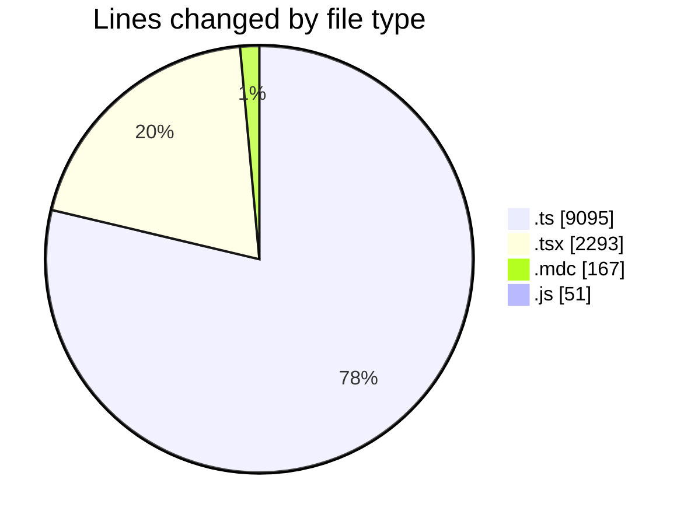
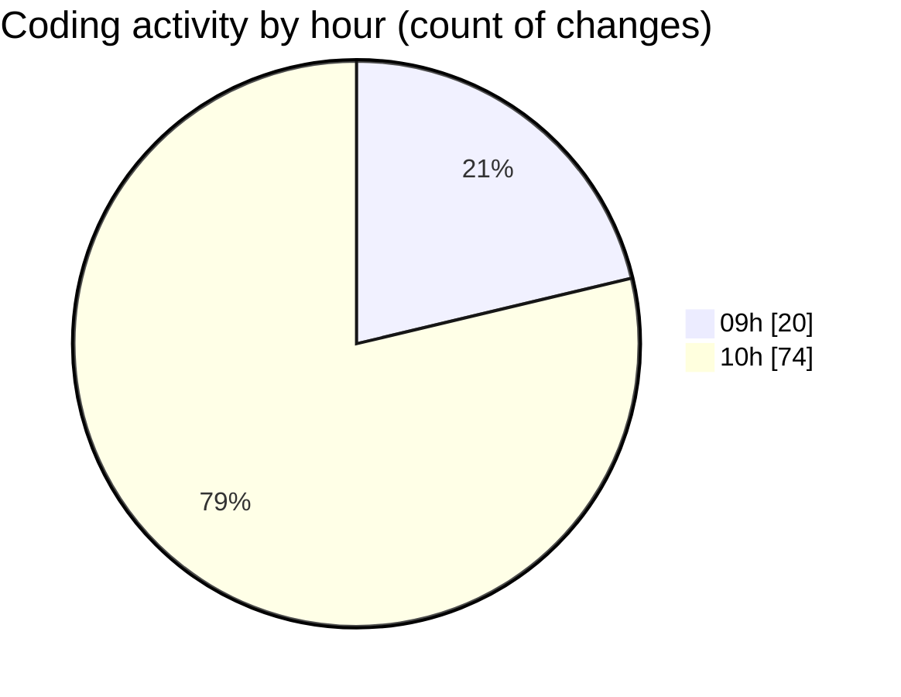

# ecodeli-1 - Activity Summary 

## Overall Statistics

| Stat                   | Value                                                             |
| ---------------------- | ----------------------------------------------------------------- |
| **Lines Added** (➕)   | 10598                                          |
| **Lines Removed** (➖) | 1008                                        |
| **Net Change** (↕)    | 9590                |
| **Active Time** (⌚)   | 137 minutes |

## Modified Files
- **trpc.ts** (+335, -14)
- **layout.tsx** (+37, -3)
- **auth.ts** (+124, -4)
- **next-auth.ts** (+268, -0)
- **route.ts** (+47, -8)
- **admin-user.router.ts** (+98, -52)
- **user-management.schema.ts** (+258, -0)
- **admin.service.ts** (+10, -2)
- **admin-dashboard.router.ts** (+217, -0)
- **delivery.router.ts** (+1172, -0)
- **delivery.service.ts** (+1878, -0)
- **root.ts** (+2, -0)
- **financial.router.ts** (+623, -0)
- **announcement.router.ts** (+1028, -0)
- **commission.service.ts** (+1035, -378)
- **windows.mdc** (+0, -2)
- **payment.service.ts** (+1257, -0)
- **maps.service.ts** (+55, -0)
- **messaging.service.ts** (+19, -0)
- **messaging.router.ts** (+33, -0)
- **test-admin-users.ts** (+52, -0)
- **test-trpc-client.ts** (+46, -0)
- **page.tsx** (+95, -78)
- **user-management.tsx** (+693, -8)
- **list.mdc** (+165, -0)
- **test-users.js** (+51, -0)
- **debug-users.ts** (+78, -0)
- **utils.ts** (+2, -0)
- **page.tsx** (+920, -459)

## Visualizations

### By File Type (Lines Changed)

### By Hour (Estimated Activity Count)

> **Last Updated:** 6/6/2025, 10:59:11 AM