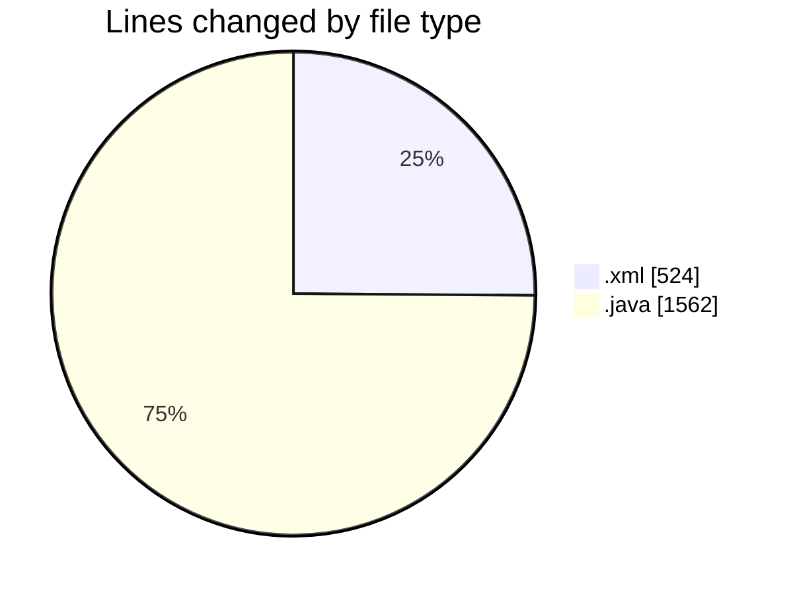
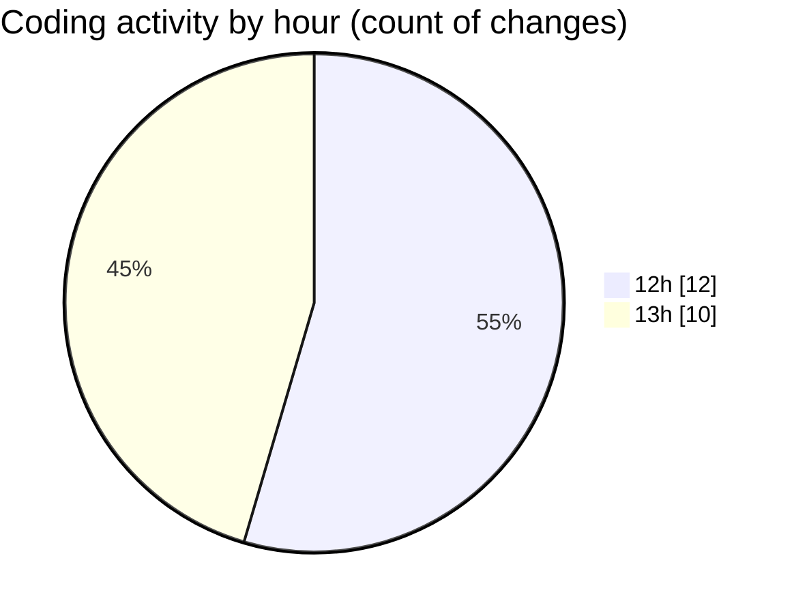

# AndroidSumApp - Activity Summary 

## Overall Statistics

| Stat                   | Value                                                             |
| ---------------------- | ----------------------------------------------------------------- |
| **Lines Added** (➕)   | 2086                                          |
| **Lines Removed** (➖) | 0                                        |
| **Net Change** (↕)    | 2086                |
| **Active Time** (⌚)   | 22 minutes |

## Modified Files
- **activity_main.xml** (+300, -0)
- **activity_objectives.xml** (+184, -0)
- **ObjectivesActivity.java** (+324, -0)
- **MainActivity.java** (+881, -0)
- **AndroidManifest.xml** (+40, -0)
- **StatsActivity.java** (+357, -0)

## Visualizations

### By File Type (Lines Changed)

### By Hour (Estimated Activity Count)

> **Last Updated:** 6/9/2025, 1:07:52 PM